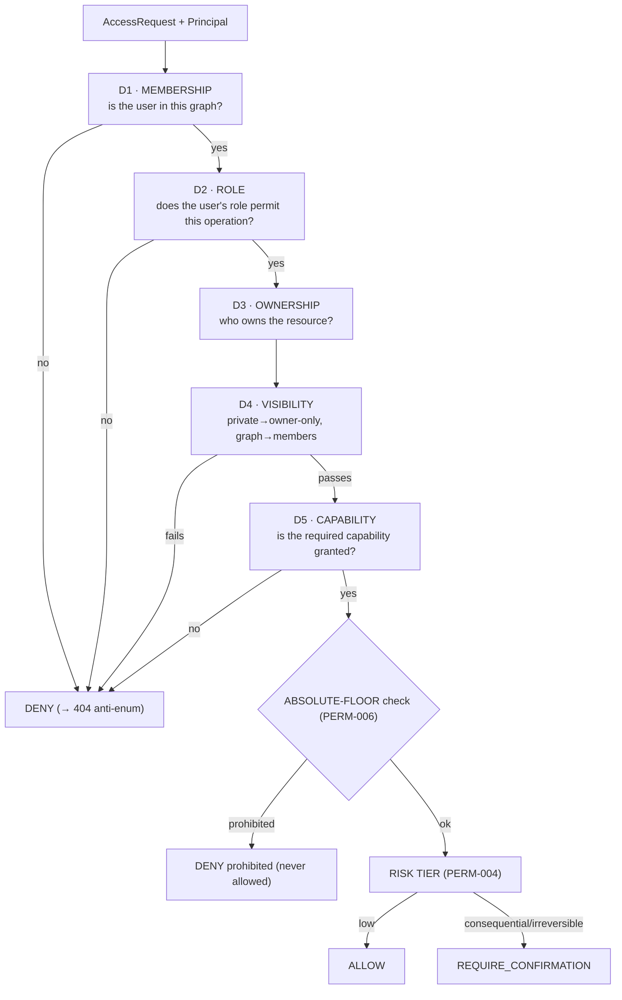
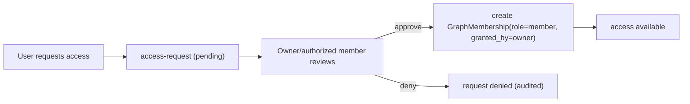

# 04_AUTHORIZATION_GRAPH_RESOURCE.md
## Hypermind Track B — Authorization / Graph / Resource Engine

**Package:** subsystem doc 04 of 17 · **Depth:** DEEPEST · **Status:** implementation contract
**Authority:** subordinate to `00_CANONICAL_PRD`. Realizes PRD §11 (GRAPH-001..009), §11A (RAUTH-001..005), and the invariants INV-3/4/5 (§31 of the PRD). Consumes the authenticated **Principal** produced by `03` (§8 of that doc); consumes the entity schemas from `01`.
**Consumed by:** every resource-touching endpoint in `02`; the agent runtime (`05`) resolves context through this engine; memory/files/tasks (`11`, `09`, scheduler) enforce visibility via it; `14` validates its guarantees; `17` tests it.

**Why this is a DEEPEST document:** this is the single most important correctness surface in Track B. The most likely catastrophic failure of a multi-user personal-agent runtime is **one user's private data leaking to another user in a shared graph.** Getting this engine exactly right is what prevents that. Every rule here is `[LOCKED]` unless marked otherwise.

**Label legend:** `[LOCKED]` · `[IMPL]` · `[FUTURE]` · `[OPEN — OWNER]`.

---

## 0. The one sentence this document exists to enforce

> **Being a member of a graph does not grant access to every resource in it.**

Authorization is **not** a single yes/no on graph membership. It is the conjunction of **five independent dimensions**, and a resource is accessible only if *all applicable* dimensions pass. The rest of this document is the precise machinery of that sentence.

The second load-bearing rule, inherited from `03` and PRD PHONE-003: **the client's claim of identity/graph/session is never trusted.** This engine starts from the `03`-validated Principal and re-derives every authorization fact server-side. A `graph_id` in a request body is a *claim to check*, never a grant.

---

## 1. Inputs and outputs of the engine

**Input — the authenticated Principal (from `03` §8):**
```
Principal = { user_id, device_id, session_id, active_graph_id? }   # all validated by 03, never client-asserted
```
**Input — the access request:**
```
AccessRequest = {
  principal: Principal,
  operation: enum(read | write | create | delete | share | administer),
  resource_type: enum(mem0fact | fileresource | scheduledjob | graph | membership | agentconfig | capability_grant),
  resource_ref: id | null,          # null for create
  graph_id: id | null,              # the graph context of the operation
  required_capability: string | null
}
```
**Output — a `PermissionDecision` (`01` §7.2):**
```
PermissionDecision = { decision: allow | deny | require_confirmation, risk_category, reason, ... }
```
`[LOCKED]` Every call produces a `PermissionDecision` and an `AuditEvent` (`01` §11.1). No resource operation happens without passing through this engine — there is no side door.

---

## 2. The five authorization dimensions (RAUTH-001)



Each dimension is defined precisely below. **All applicable dimensions must pass.** They are evaluated in the order above because it is both the cheapest-first ordering and the safest (membership failure short-circuits before any resource is even looked at, preventing existence leakage).

### D1 — Membership (RAUTH-001 dim 1)
- Is there an **active** `GraphMembership (graph_id, user_id)` with `revoked_at IS NULL`? (`01` §3.2)
- For a non-graph-scoped resource (a user's own private resource with `graph_id = null`), D1 is trivially satisfied by `owner_user_id == principal.user_id`.
- `[LOCKED]` Failure → **deny, surfaced as `404 not_found`** (`02` §1.7), never a distinguishable "you're not a member of graph X" — that would leak the graph's existence (anti-enumeration, INV, SEC-Q).

### D2 — Role (RAUTH-001 dim 2)
- MVP roles: `owner`, `member` (`01` enum; richer roles are OD-E1 `[FUTURE]`).
- Role gates *graph-management* operations, not resource-content operations:
  - `member` may: read/create/write/delete/share **their own** resources; read graph-shared resources; read the graph.
  - `owner` may additionally: approve/revoke memberships; delete the graph; transfer ownership (§6); administer graph-level `AgentConfiguration`.
- `[LOCKED]` A `member` cannot approve members, cannot delete the graph, cannot administer another member — those are `owner`-only. A `member` attempting them → deny.

### D3 — Ownership (RAUTH-001 dim 3)
- Every visibility-bearing resource carries `owner_user_id` (`01` §1.1 visibility triplet).
- Ownership does not by itself grant or deny read to others — it feeds D4 (visibility) and gates owner-only operations (change visibility, delete, share).
- `[LOCKED]` **Only the owner** may: delete the resource, change its `visibility`, or share it. A non-owner attempting any of these → deny, even if they are a graph member and even if the resource is `visibility: graph` (a shared resource is still owned by one user; other members can *read* it, not *re-govern* it).

### D4 — Visibility (RAUTH-003 — THE critical dimension)
This is the rule that prevents cross-user leakage inside a shared graph.
- `visibility: private` → readable **only** by `owner_user_id`. **Not** by other graph members, no matter that they share `graph_id`.
- `visibility: graph` → readable by any active member of `graph_id`.
- `[LOCKED]` **Default is always `private`** (RAUTH-005). A resource becomes `graph`-visible only by an explicit, owner-initiated, audited `share` operation (§5).
- `[LOCKED]` **`graph_id` alone never authorizes a read.** The presence of a `graph_id` on a resource is a *scoping* fact, not an *authorization* fact. The read predicate is:
  ```
  readable(user, resource) :=
      resource.visibility == "graph"  AND  active_member(user, resource.graph_id)
   OR resource.owner_user_id == user
  ```

### D5 — Capability (RAUTH-001 dim 5)
- If the operation requires a capability (e.g. an agent tool action, a device action), there must be an active `CapabilityGrant` for the principal covering it (`01` §7.1, PERM-002).
- `[LOCKED]` Capability is checked *in addition to* D1–D4, never instead of them. A granted capability does not bypass visibility: holding `file.read` does not let you read another user's `private` file.

### Absolute-floor gate (PERM-006) — after the five dimensions
- Even if D1–D5 all pass, the operation is checked against the **absolute-floor prohibitions** (`01` §7.1, PRD PERM-006): obtain/reveal superuser creds, retrieve another user's private graph/secrets, disable auth/audit, escape sandbox, obtain master keys, self-escalate, exfiltrate credentials.
- `[LOCKED]` These are prohibited **by absence of any capability that grants them** — there is no `CapabilityGrant` that can authorize them (`01` §7.1 validation), so this gate should be unreachable in practice; it exists as a defense-in-depth backstop. A request that somehow reaches it → `403 prohibited`, hard stop, high-priority audit.

### Risk tier (PERM-004) — final step for *actions*
- For read operations: none needed.
- For write/create/delete/share/administer and agent-proposed actions: classify into `low_read | low_write | consequential | high_irreversible` and either `allow` or `require_confirmation` per the formal (deterministic) confirmation policy. Detailed in `07`; this engine invokes it and records the `risk_category` on the `PermissionDecision`.

---

## 3. The canonical decision algorithm (deterministic, `[LOCKED]`)

```
function authorize(request, principal) -> PermissionDecision:
    audit = start_audit(request, principal)          # AuditEvent, correlated by request_id

    # D1 MEMBERSHIP
    if request.graph_id is not null:
        if not active_member(principal.user_id, request.graph_id):
            return deny(audit, "not_a_member", surface=404)      # anti-enum
    # (graph_id null → personal resource; membership implicit via ownership below)

    # Resolve resource (for non-create ops)
    resource = load(request.resource_ref) if request.resource_ref else null
    if request.operation != create and resource is null:
        return deny(audit, "not_found", surface=404)

    # D2 ROLE
    if not role_permits(principal, request.operation, request.graph_id):
        return deny(audit, "role_forbids", surface=403)

    # D3 OWNERSHIP (for owner-only ops)
    if request.operation in {delete, share, change_visibility} and resource.owner_user_id != principal.user_id:
        return deny(audit, "owner_only", surface=403)

    # D4 VISIBILITY (for reads and read-implying ops)
    if request.operation == read and not readable(principal.user_id, resource):
        return deny(audit, "not_visible", surface=404)           # anti-enum: private looks absent

    # D5 CAPABILITY
    if request.required_capability and not capability_active(principal, request.required_capability, request.graph_id):
        return deny(audit, "capability_missing", surface=403)

    # ABSOLUTE FLOOR
    if is_absolute_floor(request):
        return deny(audit, "prohibited", surface=403)            # should be unreachable; backstop

    # RISK TIER (actions only)
    tier = risk_tier(request)
    if tier in {consequential, high_irreversible} and not already_confirmed(request):
        return require_confirmation(audit, tier)

    return allow(audit, tier)
```

`[LOCKED]` Properties this algorithm must have:
- **Fail-closed:** any error/uncertainty in any step → deny, never allow (PRD FAIL-CORE-003). A `load()` failure, a null membership lookup result, an ambiguous role — all deny.
- **Deterministic:** no model/LLM participates in this decision. It is pure code over stored facts (INV-2). An LLM may *propose* an action; this engine *decides* it (INV-1/P1).
- **Total:** every path returns a `PermissionDecision`; there is no implicit allow.
- **Audited:** every decision emits an `AuditEvent` with the outcome and reason.

---

## 4. Graph lifecycle

### 4.1 Create (GRAPH-007)
```
POST /graphs {name, type} → creator becomes owner
  → create Graph(owner_user_id = creator, type)
  → create GraphMembership(graph_id, creator, role=owner)
```
`[LOCKED]` A `private` graph has exactly one membership (its owner); a `shared` graph starts with the owner and grows via approval (§4.2). Creating a graph is not rate-exempt (RATE-001).

### 4.2 Join request → approval (GRAPH-008)

- `[LOCKED]` Membership is created **only** by an owner (or, `[FUTURE]`, a role explicitly permitted to approve) via an explicit approval — never self-service, never by the requester asserting it. `granted_by` records who approved (`01` §3.2).
- The requester must be an authenticated Hypermind user (`03`); approval binds their `user_id` into the graph.

### 4.3 Leave / revoke
- A `member` may leave (revoke their own membership → `revoked_at` set).
- An `owner` may revoke any member's membership.
- `[LOCKED]` Revocation is immediate: the next authorization check for that user in that graph fails D1. Their **private** resources in that graph remain theirs (owner-controlled); their **graph-shared** resources remain in the graph (they shared them deliberately) unless they un-share before leaving — `[OPEN — OWNER] OD-AUTHZ-1`: on leave, do graph-shared resources stay or auto-unshare? Recommendation: **stay** (sharing was a deliberate act; retroactive removal on leave is surprising), but flag for owner decision.

### 4.4 Delete graph
- `owner`-only. Cascades per LIFE-003: memberships, and graph-scoped resources are handled by their owners' data (a shared graph's deletion must not delete a member's *private* data that happened to be scoped there — `[LOCKED]` deletion removes the graph + graph-shared content; each member's private resources scoped to it follow that member's data-lifecycle, not the graph's). This interaction is subtle — detailed in `11` (memory) and `09` (files); this engine's rule is: **deleting a graph never deletes another user's private data.**

---

## 5. Sharing (the explicit visibility change)

```
POST (owner-only) change_visibility(resource, private → graph)
  → D3 ownership check (must be owner)
  → set resource.visibility = graph
  → emit AuditEvent(actor=user, action=share, resource) [RAUTH V2, LOCKED]
```
- `[LOCKED]` Sharing is owner-only, explicit, and audited. It is **never** a side effect of any other operation (RAUTH-005). Un-sharing (`graph → private`) is the same, reversible, owner-only, audited.
- `[LOCKED]` **Sharing a graph, or sharing a resource into a graph, never shares secrets** (GRAPH-009). A `SecretReference` is never made graph-visible by any share operation — secrets are scoped independently (`01` §8, `12`). This engine refuses any request to `share` a `secret`-class resource: `403 prohibited`.

---

## 6. Ownership transfer `[IMPL, constrained]`
- An owner may transfer graph ownership to another member (owner-only operation). The new owner gets `role=owner`; the old owner becomes `member` (or leaves). Audited.
- `[IMPL]` exact flow (immediate vs. accept-required); `[LOCKED]` constraint: a graph always has exactly one owner; transfer is atomic (no zero-owner or two-owner window).
- Resource ownership does **not** transfer with graph ownership — each resource's `owner_user_id` is unchanged (a graph owner does not thereby own members' resources). `[LOCKED]`

---

## 7. The anti-enumeration property (why some denials are 404, not 403)

`[LOCKED]` The engine deliberately collapses two cases into `404 not_found`:
1. the resource genuinely does not exist, and
2. the resource exists but is not visible to the caller (private, or in a graph they're not in).

If these were distinguishable (403 "forbidden" vs 404 "absent"), a malicious member could enumerate *what exists* in a shared graph or probe for other users' private resources by observing which IDs return 403 vs 404 (SEC-Q/R). Collapsing to 404 removes that oracle. Role/capability failures on *your own* accessible resources may return 403 (no existence leak there). The rule: **a denial that would reveal the existence or visibility of a resource the caller can't see returns 404; a denial about an operation on a resource the caller can already see returns 403.**

---

## 8. Interaction with the agent runtime (`05`)

The agent never authorizes itself. When the agent proposes an action (a tool call, a memory read, a file access), the runtime constructs an `AccessRequest` **on behalf of the principal** and passes it through this engine (`05` wires this). The agent's proposal is input; this engine's `PermissionDecision` is authority (INV-1). Specifically:
- Agent proposes "read memory about X" → runtime builds a read `AccessRequest` → engine applies D4 visibility filter → agent receives only the facts the *principal* may see (not everything in the graph). `[LOCKED]` The agent's context is bounded by the principal's authorization, so the agent cannot become a confused-deputy that reads another user's private data on the principal's behalf.
- Agent proposes a consequential action → engine returns `require_confirmation` → runtime surfaces it to the human (`02` §5, PERM-004).

---

## 9. Failure & edge behavior

| Situation | Behavior | Rule |
|---|---|---|
| Membership lookup errors | deny (fail-closed) | FAIL-CORE-003 |
| Resource load errors | deny (fail-closed) | FAIL-CORE-003 |
| `active_graph_id` on session references a graph the user left | re-checked live → D1 fails → deny | `01` §2.3 (row is not trusted) |
| Two concurrent share/unshare on one resource | last-writer-wins on `visibility`, both audited | `[IMPL]` |
| A resource with `graph_id` set but `visibility` missing | treated as `private` (safe default) | RAUTH-005 |
| Capability expired mid-session | next check fails D5 | `01` §7.1 |
| Absolute-floor reached | 403 prohibited + high-priority audit | PERM-006 |

---

## 10. Open items

| ID | Question | Status |
|---|---|---|
| **OD-AUTHZ-1** | On leaving a graph, do the leaver's graph-shared resources stay or auto-unshare? | `[OPEN — OWNER]`; rec: stay |
| OD-E1 (PRD) | Roles beyond owner/member | `[FUTURE]`; enum extends without schema break |
| OD-AUTHZ-2 | Ownership-transfer flow (immediate vs accept-required) | `[IMPL]`, non-blocking |
| OD-AUTHZ-3 | Concurrent visibility-change conflict policy | `[IMPL]`, last-writer-wins default |

---

## 11. Acceptance hooks (for `17` — these are release-blocking, this is the leak-prevention surface)

- **AZ-T1** a graph member **cannot** read another member's `private` resource in the same graph (RAUTH-003) — returns `404`. *(The single most important test in Track B.)*
- **AZ-T2** a resource defaults to `visibility: private` on creation (RAUTH-005).
- **AZ-T3** a non-member's request for a graph resource returns `404`, indistinguishable from "doesn't exist" (anti-enum).
- **AZ-T4** only the owner can change a resource's visibility or delete it (D3); a member gets `403`.
- **AZ-T5** a share operation on a `secret`-class resource is refused (`403 prohibited`) (GRAPH-009).
- **AZ-T6** a `member` cannot approve memberships or delete the graph (D2).
- **AZ-T7** a granted `file.read` capability does **not** let the holder read another user's `private` file (D5 ≠ bypass of D4).
- **AZ-T8** revoking a membership immediately fails that user's next access check (D1).
- **AZ-T9** any error in the decision path results in `deny`, never `allow` (fail-closed).
- **AZ-T10** the agent, acting for principal A, cannot read principal B's private data even if both are in the same graph (confused-deputy prevention, §8).
- **AZ-T11** deleting a shared graph does not delete a member's private data scoped to it (§4.4).
- **AZ-T12** every authorization decision emits an `AuditEvent` with outcome + reason.

---

*End of 04_AUTHORIZATION_GRAPH_RESOURCE (DEEPEST). Next: `05_AGENT_RUNTIME.md` — the proposal→authorize→execute loop that calls this engine on every action. Changes here propagate to 02, 05, 09, 11, 12, 14, 17.*
