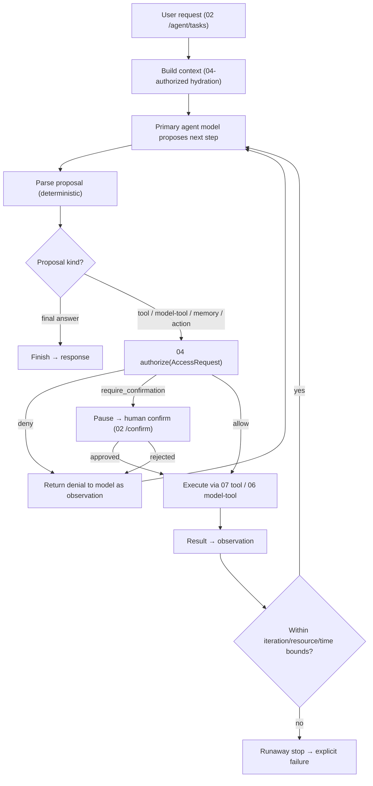

# 05_AGENT_RUNTIME.md
## Hypermind Track B — Agent Runtime Execution Spec

**Package:** subsystem doc 05 of 17 · **Depth:** deep · **Status:** implementation contract
**Authority:** subordinate to `00_CANONICAL_PRD`. Realizes PRD AGENT-001..004, the control principle P1, GRAPH-004 (request lifecycle), and RATE-001 (bounded orchestration). Consumes the authenticated Principal (`03`), routes every action through the authorization engine (`04`), invokes models/tools per (`06`/`07`), and emits UsageEvents (`13`).
**Consumed by:** `02` agent endpoints call this; `07` tools are invoked by this; `14` validates its containment; `17` tests it.

**Label legend:** `[LOCKED]` · `[IMPL]` · `[FUTURE]` · `[OPEN — OWNER]`.

---

## 0. The one rule this document exists to enforce

> **The agent proposes; deterministic infrastructure decides and executes; the human confirms where the risk model requires it.** (P1)

The runtime is the loop that *hosts* a primary agent model, but it is built so the model is structurally incapable of taking a security-relevant action on its own. Every action the model "wants" is a **proposal** that must pass `04`'s authorization engine before anything happens. The runtime is deterministic plumbing around a probabilistic core.

---

## 1. The loop (canonical)

`[LOCKED]` The only two ways a step reaches execution are `allow` or a human-`approved` `require_confirmation`. A `deny` is fed back to the model as an *observation* ("that action was not permitted"), never silently retried and never escalated by the model.

---

## 2. Stages (each: responsibility · det/AI · failure)

| Stage | Responsibility | Det/AI | Failure behavior |
|---|---|---|---|
| Build context | hydrate only what the principal may see (`04` D4) + relevant memory/vault (`11`) | deterministic | missing store → degrade w/ explicit note (FAIL-008/009) |
| Model propose | agent emits next step (tool call / model-tool / answer) | AI | malformed proposal → treat as parse failure (§6) |
| Parse proposal | deterministic parse into a typed proposal | deterministic | unparseable → bounded retry → fail |
| Authorize | route through `04` | deterministic | any error → deny (fail-closed) |
| Confirm | surface consequential actions to human | deterministic + human | timeout → **not** auto-approved (PERM-004) |
| Execute | run tool/model-tool in its boundary | deterministic dispatch | tool/model down → 503-class observation (FAIL-005/006) |
| Observe | feed result back to model | deterministic | oversized result → truncate + note |
| Bound check | enforce iteration/resource/time caps | deterministic | breach → runaway stop |
| Finish | return final response | deterministic render | — |

---

## 3. Bounds (RATE-001 — a runaway agent must be impossible)

`[LOCKED]` Every task runs under hard, deterministic ceilings, enforced by the runtime (not the model):
- **max_iterations** — total propose→execute cycles per task. Exceeded → runaway stop.
- **max_tool_calls** and **max_model_calls** per task.
- **max_model_tool_nesting_depth** — an LLM-as-tool (`06`) may itself be an agent-ish call; nesting is capped (default shallow, e.g. 1–2) to prevent an agent calling a model that calls a model unboundedly. `[IMPL]` exact depth, but a finite cap is locked.
- **wall_clock_timeout** per task.
- **per-task budget** (paid-provider cost ceiling, `13`) — breach → stop with explicit "budget exceeded" (RATE-001).
- **concurrency** — per-user/session concurrent-task cap.

`[LOCKED]` Exact numeric values are OD-02 (PRD) / `[IMPL]`, but the *existence and enforcement* of every ceiling is locked. Breach of any ceiling → **explicit failure surfaced to the user** (FAIL-CORE-001), never a silent stop and never a fabricated "done."

Session-scoped state only: the runtime holds per-task counters for the task's duration and discards them at task end (`02` §11 spirit) — no cross-task memory lives in the runtime (that's Mem0, `11`).

---

## 4. Confirmation & absolute-floor interaction (PERM-004/006)

- When a proposal's `04` decision is `require_confirmation`, the runtime **pauses the task**, returns `confirmation_required` (`02` §5) with a `confirmation_token`, and does nothing further on that branch until `/confirm` arrives.
- `[LOCKED]` No timeout auto-approves. If the human never confirms, the action never happens; the task can be cancelled or expire *without* performing the action.
- An **absolute-floor** proposal (PERM-006) returns `prohibited` — it is never offered as confirmable. The runtime feeds this back to the model as a hard denial and does not surface a confirmation prompt.

---

## 5. Model provider & fallback (MODEL-001..005, ties `06`)

- The primary agent model is resolved from the effective `AgentConfiguration` (`01` §4.1) via the ModelProvider interface (`06`). The runtime is provider-agnostic — it speaks the normalized invoke contract, not a vendor SDK.
- **Fallback** (`[IMPL, constrained]`): if the primary model call fails (FAIL-005), the runtime may fall back to a configured fallback model **only if one is configured**; otherwise it fails explicitly. Fallback is deterministic (the runtime decides to fall back, not the model), and a fallback invocation still counts against bounds/budget.
- `[LOCKED]` A model being unavailable never produces a fabricated answer (FAIL-CORE-002) — it produces an explicit failure.

---

## 6. Failure handling within the loop

| Failure | Handling |
|---|---|
| Malformed/unparseable model proposal | bounded retry (re-prompt) → then fail the task explicitly |
| Model refusal ("I can't do that") | treated as a normal failure, not coerced into a fake action (mirrors Track A MR-tests) |
| Tool failure | result-as-observation ("tool X failed: reason"); model may replan within bounds |
| Model-tool (LLM-as-tool) failure | same as tool failure; nesting bound still applies |
| Dependency down (Mem0/Vault/etc.) | degrade with explicit note; continue on available context (FAIL-008/009) |
| Oversized tool/model output | truncate + note; never blow the context window silently |
| Authorization deny | denial-as-observation; model replans or finishes; never bypassed |

`[LOCKED]` The model may **replan** after a denial or a tool failure (that's normal agentic behavior), but replanning is subject to the same bounds — it cannot be used to grind past a ceiling.

---

## 7. Context compaction (MEM-002 — don't dump lifetime history)

- Context is **hydrated relevantly**, not maximally (GRAPH-004/MEM-002): current task context + `04`-authorized relevant memory (`11`) + relevant vault (`21`). The whole of a user's history is never loaded.
- When a long task's running context approaches the model's window, the runtime **compacts** (summarize-older-turns / drop-stale-observations) deterministically — `[IMPL]` the strategy, `[LOCKED]` that compaction never fabricates and never elevates a compacted summary to a validated fact.
- `[LOCKED]` Compaction respects visibility: a compacted summary of context that the principal could see stays within the principal's authorization; compaction never merges another user's private data in (it was never in context to begin with, per §8).

---

## 8. Confused-deputy prevention (ties `04` §8)

`[LOCKED]` The runtime constructs every `AccessRequest` **as the principal**, never as "the agent." So:
- The agent's context is bounded by the principal's `04` visibility — it cannot read another user's private data even in a shared graph, because the hydration step already filtered to what the principal may see.
- The agent cannot escalate by "asking" — a proposal to read/act beyond the principal's authorization is denied by `04` exactly as if the principal made it directly.
This is the single most important containment property of the runtime: **the agent can never do, on the principal's behalf, anything the principal could not do themselves.**

---

## 9. Cancellation & lifecycle

- A task can be cancelled (`02` /cancel) — the runtime stops the loop, aborts any in-flight tool (within the tool's own timeout), and records the cancellation.
- A task that hits a bound stops with an explicit runaway/limit failure.
- A task that finishes returns its final response; the runtime persists relevant state (GRAPH-004) — including writing any durable memory the task legitimately produced, via `11` (subject to visibility defaults: new memories default `private`).

---

## 10. Streaming (`[IMPL]`, ties `02` §1.9)
The runtime may stream partial output. A streamed task still enforces all bounds, still routes actions through `04`, still emits its UsageEvent on completion/failure, and can terminate mid-stream in an explicit error (the client must handle a stream that ends in failure).

---

## 11. Determinism boundary (what the runtime owns vs the model)

| Runtime owns (deterministic) | Model owns (proposes only) |
|---|---|
| context hydration + visibility filter | what to do next (proposal) |
| proposal parsing | phrasing/reasoning |
| authorization (via `04`) | replanning after denial/failure |
| execution dispatch | the final answer content |
| bounds/budget/timeout enforcement | — |
| confirmation gating | — |
| fallback decision | — |
| UsageEvent/AuditEvent emission | — |

`[LOCKED]` Nothing in the left column is ever delegated to the model. This table *is* the P1 boundary made concrete for the runtime.

---

## 12. Open items

| ID | Question | Status |
|---|---|---|
| OD-RT-1 | max_model_tool_nesting_depth value | `[IMPL]`; finite cap locked, rec 1–2 |
| OD-RT-2 | context-compaction strategy | `[IMPL]`; non-fabricating constraint locked |
| OD-RT-3 | AgentConfiguration resolution precedence (user vs graph scope) — carried from PRD `[IMPL, constrained: must be deterministic + documented]` | resolve before multi-scope configs ship |
| OD-02 (PRD) | exact bound numeric values | `[IMPL]`; existence locked |

---

## 13. Acceptance hooks (for `17`)

- **RT-T1** an agent proposal for an unauthorized action is denied by `04` and never executed; the denial is fed back, not bypassed (P1).
- **RT-T2** a task exceeding max_iterations/tool-calls/model-calls/timeout/budget stops with an explicit failure, never a silent or fabricated finish (RATE-001, FAIL-CORE-001).
- **RT-T3** a consequential action pauses for human confirmation and does not execute on timeout (PERM-004).
- **RT-T4** an absolute-floor proposal returns `prohibited`, never a confirmation prompt (PERM-006).
- **RT-T5** the agent acting for principal A cannot read principal B's private data in a shared graph (confused-deputy, §8).
- **RT-T6** a model outage produces an explicit failure, never a fabricated answer (FAIL-CORE-002).
- **RT-T7** model-tool nesting cannot exceed the configured depth.
- **RT-T8** every task emits UsageEvents for its model/tool calls (USAGE-001).
- **RT-T9** context compaction never introduces a fact absent from authorized context.
- **RT-T10** replanning after a denial cannot be used to exceed any bound.

---

*End of 05_AGENT_RUNTIME. Continues to 06.*
