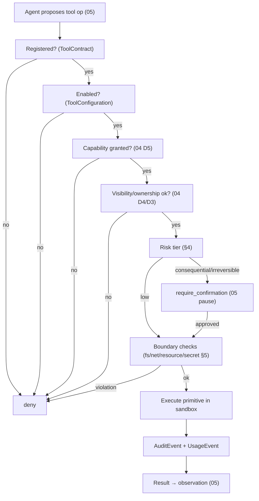

# 07_TOOL_CAPABILITY_EXECUTION.md
## Hypermind Track B — Tool / Capability / Execution

**Package:** subsystem doc 07 of 17 · **Depth:** deep · **Status:** implementation contract
**Authority:** subordinate to `00_CANONICAL_PRD`. Realizes TOOL-001..004, PERM-001..007. Uses `ToolContract`/`ToolConfiguration`/`CapabilityGrant`/`PermissionDecision` (`01`); every tool call is authorized by `04` and dispatched by `05`; boundaries enforced by `09` (fs) / `10` (net) / `12` (secrets).
**Consumed by:** `05` (dispatch), `08` (device tools are a tool family), `06` (model-tools are a tool family), `14`/`17`.

**Label legend:** `[LOCKED]` · `[IMPL]` · `[FUTURE]` · `[OPEN — OWNER]`.

---

## 0. The chain this document defines

```
user grants CAPABILITY  →  (scoped to a resource_scope)  →  gates a TOOL
  →  which exposes OPERATIONS  →  each mapping to concrete EXECUTION PRIMITIVES
```
`[LOCKED]` A tool runs only if: it's **registered** (has a `ToolContract`), it's **enabled** (`ToolConfiguration`), the required **capability is granted** to the principal, the operation's **boundaries** (fs/net/resource) are satisfied by policy, `04` **authorizes** it, and — for consequential/irreversible operations — the human **confirms** (PERM-003/004). All checks deterministic; none delegated to the model.

---

## 1. Tool registry & contract (TOOL-001..003)

- **Internal registry** `[LOCKED]`: Track B has its own tool registry; a tool must publish a `ToolContract` (`01` §10) to be registerable. No contract → not registerable → cannot run (TOOL-003).
- **Tool families** (all use the same machinery): filesystem (`09`), network/web (`10`), Android/device (`08`), scheduler, memory (`11`), vault (`11`), **LLM-as-tool** (`06`), **MCP-adapter** tools (§6), future IntelligenceProvider (`25`).
- **Enabled instance**: a `ToolConfiguration` (`01` §9.3) turns a contract into a usable tool in a given scope, with `secret_ref`/overrides. A registered-but-not-enabled tool is inert; a `validation_status`-style gate applies (a provisional/untrusted tool is registered but not runnable until enabled by a human).

---

## 2. Capabilities (PERM-001/002)

- **Capability-based, not per-primitive-prompt** `[LOCKED]` (PERM-001): the user grants a capability (e.g. `app.interact`, `file.read`, `file.write`, `device.read`, `device.ui_control`, `system.restricted`) once; the agent may then compose *many* operations within it without re-prompting per primitive (PERM-002). This is what makes a usable Jarvis without a confirmation storm.
- **`CapabilityGrant`** (`01` §7.1) records principal, scope_type (user/graph/device/session/task), capability, `resource_scope` (narrowing — e.g. *which* app, *which* sandbox root), grantor, expiry. User consent (PERM-002) is the grantor act.
- **Deterministic validation still applies** `[LOCKED]` (PERM-003): `capability grant → operation validation → dangerous-operation restriction → execution`. A capability is *permission to attempt operations in a class*, not a blank cheque — each concrete operation is still validated (§4) and boundary-checked (§5).
- **Capability ≠ visibility bypass** `[LOCKED]`: holding `file.read` never lets you read another user's `private` file — `04` D4 still gates it (ties `04` §2 D5).

---

## 3. Operation → primitive mapping

`[LOCKED]` A capability maps to a **defined, enumerable set of operations**, and each operation maps to concrete **execution primitives** — never an open-ended "do anything in this class." Example shape (device family, detailed in `08`):
```
capability app.interact
  → operations { tap, swipe, input_text, read_screen_element, launch_activity }
     → each → concrete Accessibility/Shizuku primitive (08)
```
`[LOCKED]` (AND-006 tie): capability names that *sound* like universal CRUD (`file.read`) do **not** grant universal CRUD — they grant exactly the operations their mapping enumerates. An operation not in the mapping is not executable, even with the capability.

---

## 4. Risk tiers & confirmation policy (PERM-004/005)

`[LOCKED]` Four tiers, and a **formal, deterministic** policy — confirmation need is decided by policy, never by model judgment (PERM-005):

| Tier | Examples | Default disposition |
|---|---|---|
| `low_read` | read battery, read a screen element, read own memory | **automatic** |
| `low_write` | edit a local document in own sandbox, set a reminder | **automatic** (or light confirm per config) |
| `consequential` | send a message, post externally, share a resource, external network write | **require_confirmation** |
| `high_irreversible` | financial action, bulk delete, irreversible external effect | **require_confirmation (strong)** |
| *(prohibited)* | change security policy, expose secrets, self-escalate | **never** (§7) |

- **`[IMPL]` the exact threshold assignment** per operation, but `[LOCKED]`: (a) the policy is a deterministic table/ruleset, (b) every operation has a tier, (c) consequential/irreversible always require human confirmation before execution (PERM-004), (d) the confirmation happens via `05`'s pause + `02` `/confirm` — no timeout auto-approves.
- **Three-tier taxonomy explicit** (PERM-007): every operation class is one of **NEVER ALLOWED / ALLOWED WITH CONFIRMATION / ALLOWED AUTOMATICALLY**.

---

## 5. Boundary enforcement per tool

`[LOCKED]` A tool's `ToolContract` declares its `network` and `filesystem` requirements (`01` §10); the execution layer enforces them **deterministically at run time**, not by trusting the tool:
- **Filesystem** → `09`: the tool runs against a sandbox root; path traversal/symlink escapes blocked; no host-path access.
- **Network** → `10`: default-deny egress; only declared destinations; a tool cannot bypass by choosing a different network mechanism (NET-005).
- **Resource** → per-contract timeout, and per-`13` rate/concurrency limits; a tool cannot run unbounded.
- **Secrets** → `12`: a tool receives a secret only by handle resolution at the boundary; never raw in its config or logs.

---

## 6. MCP-adapter tools (TOOL-004 — trust boundary)

`[LOCKED]` An external MCP server's tool is **untrusted code**, granted no trust by protocol conformance:
- must be wrapped in a Track B `ToolContract` before it's callable (Track B asserts its schema/capability/risk/boundaries — not the MCP server's word);
- runs only under an explicitly granted capability;
- gets secrets only by handle (`12`), never raw;
- egress bound by `10`; filesystem bound by `09`; execution sandboxed (`14`);
- every invocation audited (`01` §11.1).
A malicious/compromised MCP server (threat SEC-E) is contained to its granted capability and declared boundaries — it cannot reach other users, host paths, or secrets.

---

## 7. Absolute-floor (PERM-006) — prohibition by absence

`[LOCKED]` The prohibited operations (obtain/reveal superuser creds, read another user's private graph/secrets, disable auth/audit, escape sandbox, obtain master keys, self-escalate, exfiltrate credentials) are prohibited **because no capability grants them and no tool exposes them** (`01` §7.1 validation refuses to create such a grant). There is nothing to bypass. If such a request somehow reaches the engine it returns `prohibited` (`04` absolute-floor gate) — a defense-in-depth backstop, expected unreachable. This is Track B's analogue of Track A's "no submission capability exists" (strongest guarantee = absence, PRD §5/§16).

---

## 8. Execution flow (deterministic dispatch, ties `05`)



---

## 9. Open items

| ID | Question | Status |
|---|---|---|
| OD-TOOL-1 | exact tier assignment per operation | `[IMPL]`; formal-deterministic-table constraint locked; **owner signs the tier table** |
| OD-TOOL-2 | provisional/untrusted-tool enablement gate specifics | `[IMPL]` |
| OD-TOOL-3 | which MCP servers (if any) are enabled at pilot | `[OPEN — OWNER]`; default none |

---

## 10. Acceptance hooks (for `17`)

- **TL-T1** a tool with no `ToolContract` cannot be registered or run (TOOL-003).
- **TL-T2** an operation without its required capability is denied (PERM-002).
- **TL-T3** a capability does not bypass visibility — `file.read` cannot read another user's private file (PERM/`04` D4).
- **TL-T4** a consequential operation requires confirmation and does not execute on timeout (PERM-004).
- **TL-T5** an absolute-floor operation is `prohibited` and no `CapabilityGrant` for it can be created (PERM-006).
- **TL-T6** an MCP-adapter tool gets no trust from protocol conformance; it's capability-gated + boundary-bound (TOOL-004).
- **TL-T7** a tool cannot access a filesystem path or network destination outside its contract (§5).
- **TL-T8** an operation outside a capability's enumerated mapping is not executable even with the capability (§3).
- **TL-T9** every tool execution emits AuditEvent + UsageEvent.
- **TL-T10** the confirmation decision is produced by the deterministic policy, not the model (PERM-005).

---

*End of 07_TOOL_CAPABILITY_EXECUTION. Continues to 08.*
