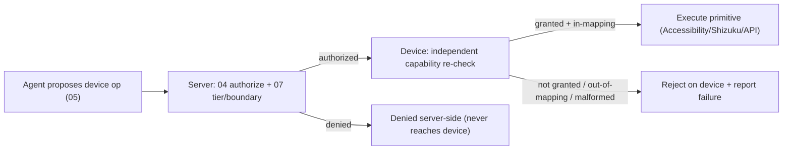

# 08_ANDROID_SHIZUKU.md
## Hypermind Track B — Android / Shizuku Execution

**Package:** subsystem doc 08 of 17 · **Depth:** deep · **Status:** implementation contract
**Authority:** subordinate to `00_CANONICAL_PRD`. Realizes AND-001..006; device tools are a **tool family** under `07` (same capability/authorization/confirmation machinery). Server-side authorization via `04`; device credential via `03`/`12`.
**Consumed by:** `07` (device tools), `05` (agent proposes device ops), `14`/`17`.

**Label legend:** `[LOCKED]` · `[IMPL]` · `[FUTURE]` · `[OPEN — OWNER]`.

---

## 0. The rule this document exists to enforce

> **A capability maps to a defined, enumerable set of concrete Android/Shizuku/Accessibility operations — never a universal read/write/execute over apps.** (AND-006)

The phone is the "hands," but bounded hands. The agent composes device operations *within a granted capability* (AND-002), and each operation is a concrete, validated primitive — not an open shell over the device.

---

## 1. Execution mechanisms (AND-001)

`[LOCKED]` Permitted device-execution mechanisms:
- **Accessibility Service** — read UI tree elements, perform UI actions (tap/swipe/input) on-screen.
- **Shizuku** — elevated (adb-level) operations without root, where explicitly needed and mapped.
- **Concrete Android APIs** — documented, specific (e.g. launch an activity, query battery/device state).

`[LOCKED]` The device is **not** an unrestricted arbitrary-shell endpoint (AND-004). If any shell-like execution exists at all, it is a **separate, much-higher-risk capability** (`system.restricted`) with its own policy, its own confirmation tier (`high_irreversible`), and its own isolation — never folded into ordinary capabilities (§6).

---

## 2. Capability → operation → primitive mapping (AND-006, ties `07` §3)

`[LOCKED]` Each device capability maps to an **enumerated** operation set; each operation maps to a concrete primitive. Illustrative (the actual full table is `[IMPL]`, owner-signed):

| Capability | Enumerated operations | Concrete primitive (mechanism) |
|---|---|---|
| `device.read` | read battery, read device state, read installed-app list | Android API queries |
| `device.ui_control` | tap, swipe, input_text, scroll | Accessibility actions |
| `app.launch` | launch a named app/activity | Android intent / Shizuku |
| `app.interact` | read_screen_element, tap_element, input_into_field (within a named app) | Accessibility on the app |
| `file.read` (device) | read a file within a granted device path | scoped file API |
| `file.write` (device) | write within a granted device path | scoped file API |
| `system.restricted` | (separate, high-risk — §6) | Shizuku elevated ops, isolated |

`[LOCKED]` (AND-006): `app.interact` on WhatsApp means exactly the enumerated UI operations on WhatsApp — not "do anything to WhatsApp," not filesystem access to WhatsApp's data (that's a different capability), not execution. `file.read` is scoped to *granted device paths*, not the whole device filesystem — mirroring the server-side sandbox principle (`09`).

---

## 3. Per-app permission UI (device-side, PRD §13)

`[LOCKED]` The APK presents a settings-style, per-app capability grid the **user** controls:
```
WhatsApp     Screen Read [ON]  UI Interaction [ON]  File Read [OFF]  File Write [OFF]  Execute [OFF]
Bank App     Screen Read [OFF] UI Interaction [OFF] ...
```
- Each toggle is a `CapabilityGrant` (`01` §7.1) scoped to that app (`resource_scope`), created by explicit user consent (PERM-002).
- `[LOCKED]` Granting `app.interact` on an app lets the agent compose many UI operations on it *without re-prompting per tap* (PERM-002) — but only the enumerated operations, and consequential actions still hit confirmation (§5).
- Revocation is immediate: toggling off revokes the `CapabilityGrant` → the next device operation for that app fails authorization.

---

## 4. Two-layer enforcement (device + server)

`[LOCKED]` (AND-003): device operations are enforced **twice**:
1. **Server-side** (`04`/`07`): the agent proposes a device op → the runtime builds an `AccessRequest` → `04` checks capability/visibility/floor → `07` checks tier/boundaries → authorized op is dispatched to the device.
2. **Device-side**: the APK independently enforces that the received op is within a currently-granted capability for that app — a device-side guard that does **not** trust the server blindly and does **not** execute an op the user has toggled off, even if the server sent it. Defense-in-depth: both must agree.



---

## 5. Risk tiers for device ops (ties `07` §4)
- Read ops (`device.read`, `read_screen_element`) → `low_read`, automatic.
- Benign UI (launch app, scroll) → `low`, automatic.
- **Consequential device actions** (sending a message via UI automation, posting, external communication) → `require_confirmation` (PERM-004) — "open WhatsApp" is automatic, "send ₹50,000" / "send this message to X" is not.
- **Irreversible/financial** → strong confirmation.
`[LOCKED]` The tier is decided by the deterministic policy, not the model; a granted `app.interact` capability does **not** imply automatic permission for every consequential action inside that app (PRD §14).

---

## 6. Shell-like / elevated execution (`system.restricted`)

`[LOCKED]` If elevated Shizuku operations beyond the enumerated safe set are ever exposed, they are:
- a **separate capability** (`system.restricted`), never bundled into `app.*`/`device.*`;
- **high-risk tier** → always confirmation, often prohibited;
- **isolated** — no ordinary tool inherits it;
- subject to absolute-floor: it can never grant self-escalation, disabling of the device-side guard, or exfiltration of the device credential (PERM-006).
`[REC]` For MVP, **do not expose arbitrary shell at all** — keep device power to the enumerated Accessibility/API operations. Arbitrary shell is `[FUTURE]` at best, and its absence is a security feature.

---

## 7. Malformed / out-of-capability operation handling (AND-003)

`[LOCKED]`
- A **malformed** agent-generated device operation → rejected (device-side and/or server-side), never executed, logged as a failure (FAIL-CORE-001). It never "best-effort" executes a garbled op.
- An operation **outside the granted capability** (or outside the capability's enumerated mapping) → rejected + audited, even if the server somehow forwarded it (device-side guard, §4).
- A **screen state that doesn't match** what the op expects (e.g. target element absent) → the op fails as an observation back to the agent (`05` §6), which may replan within bounds — it does not blindly tap coordinates.

---

## 8. Device credential & data (ties `03`/`12`)
- The device holds its long-lived credential in Android secure storage (PHONE-004); device ops never expose or exfiltrate it (absolute-floor, PERM-006).
- Screen content the agent reads is treated as the **principal's data** under `04` — it does not become cross-user-visible, and it is not persisted beyond what the task and memory rules (`11`) allow (screen data is transient task context by default, not auto-stored).

---

## 9. Open items

| ID | Question | Status |
|---|---|---|
| OD-AND-1 | full capability→operation→primitive table | `[IMPL]`; enumerated-mapping constraint locked; **owner signs** |
| OD-AND-2 | whether Shizuku is required for MVP or Accessibility-only | `[OPEN — OWNER]`; `[REC]` Accessibility-first, Shizuku only where an op truly needs it |
| OD-AND-3 | expose `system.restricted` at all in MVP? | `[REC]` no |

---

## 10. Acceptance hooks (for `17`)

- **AND-T1** a device capability maps to an enumerated operation set; an op outside it is not executable (AND-006).
- **AND-T2** the per-app permission UI toggles create/revoke `CapabilityGrant`s; revocation is immediate.
- **AND-T3** `app.interact` grant does not imply arbitrary access (no filesystem/execute) to that app.
- **AND-T4** a consequential device action (send message) requires confirmation; a benign one (open app) does not (PERM-004).
- **AND-T5** an op the user toggled off is rejected device-side even if the server forwarded it (two-layer enforcement).
- **AND-T6** a malformed device op is rejected, never best-effort executed.
- **AND-T7** the device is not an arbitrary shell; `system.restricted` (if present) is separate, isolated, high-risk (AND-004).
- **AND-T8** device ops cannot exfiltrate the device credential (PERM-006).

---

*End of 08_ANDROID_SHIZUKU. Continues to 09 (DEEPEST).*
