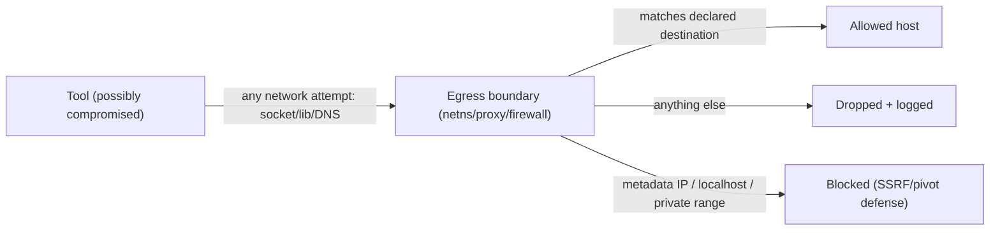

# 10_NETWORK_EGRESS.md
## Hypermind Track B — Network / Egress Enforcement

**Package:** subsystem doc 10 of 17 · **Depth:** DEEPEST · **Status:** implementation contract
**Authority:** subordinate to `00_CANONICAL_PRD`. Realizes NET-001..005. Enforced for every network-capable tool (`07`); a tool's declared network needs live in its `ToolContract` (`01` §10).
**Consumed by:** `07` (net tools), `06` (model-tools calling provider endpoints), `14`/`17`.

**Why DEEPEST:** uncontrolled egress is how a compromised tool exfiltrates data, reaches cloud metadata for credentials, pivots into the private network, or opens a reverse shell. The declared-intent-vs-enforced-boundary gap (which `06`-era Track B flagged) is closed here. Every rule `[LOCKED]` unless marked.

---

## 0. The two rules this document exists to enforce

> **1. The agent core has no arbitrary networking; network happens only through a declared tool, to a policy-allowed destination.** (NET-001)
> **2. The policy is enforced at a boundary the tool cannot bypass by choosing a different network mechanism.** (NET-005)

Rule 2 is the one that separates a real control from a paper one. A tool that opens a raw socket, uses a different library, or resolves a hostname itself must still be unable to reach a denied destination.

---

## 1. Default-deny egress (NET-001/003)

`[LOCKED]`
- Baseline: **an execution context has no outbound network.** Network is granted per-tool, per-declared-destination.
- `AGENT → declared TOOL → network policy → allowed destination`. The agent never networks directly.
- A tool with no `network.required` in its contract runs with **no** network at all (e.g. a local file processor — NET-003).

---

## 2. Per-tool network declaration (NET-002)

`[LOCKED]` Each network-capable tool's `ToolContract.network` declares: `required` (bool), `destinations[]` (allowed hosts/domains/CIDRs), `internet` (bool), `private_net` (bool), `may_send_credentials` (bool), allowed protocols/ports, rate limits. The enforcement layer grants **exactly** this and nothing more. A tool cannot self-expand its declaration at runtime.

Examples:
- web-fetch tool → `internet: true`, destination scope per call (still SSRF-guarded, §4), `may_send_credentials: false`.
- local file processor → `required: false` (no network).
- a specific-API tool → `destinations: [api.example.com]`, `internet: false` otherwise.

---

## 3. Non-bypass enforcement (NET-005 — the core guarantee)

`[LOCKED]` The policy is enforced at the **network boundary of the tool's execution context**, not by trusting the tool to honor a proxy env var. Acceptable mechanisms (`[IMPL]`, ratified in `14`):
- **Network namespace with a filtered egress path**: the tool's netns has no default route except through an egress filter/proxy; anything not matching the allowed destinations is dropped. A raw socket still hits the same filter.
- **Forced egress proxy + firewall**: iptables/nftables rules in the tool's context redirect/deny all egress except through a proxy that enforces the destination allowlist and does the DNS resolution (§5).
- **Deny-by-default firewall** on the execution context with explicit allow rules per declared destination.

`[REC]` namespace + filtered egress (physical impossibility of reaching a denied host) over env-var-proxy (which a tool can ignore). `[LOCKED]` the guarantee — *a compromised tool cannot reach a denied destination via any network mechanism* — regardless of chosen tech.

---

## 4. SSRF & metadata defense (NET-004)

`[LOCKED]` Even for a tool with `internet: true`, the egress boundary **blocks by default**:
- **Cloud metadata endpoints** (e.g. 169.254.169.254 and provider equivalents) — the classic SSRF-to-credentials path. Never reachable by a tool.
- **Localhost / loopback** (127.0.0.0/8, ::1) — prevents a tool reaching server-local services (the app itself, admin endpoints).
- **Private ranges** (RFC1918 10/8, 172.16/12, 192.168/16, link-local, ULA) unless the tool explicitly declared `private_net: true` **and** that was human-approved — prevents internal-network pivot.
- Destination checks apply to the **resolved IP**, not just the hostname (a hostname that resolves to a metadata/private IP is blocked — this is the DNS-rebinding defense, §5).

---

## 5. DNS handling & rebinding defense (NET-004)

`[LOCKED]`
- DNS resolution for a tool is performed **by the egress boundary/proxy**, not by the tool reaching a public resolver directly — so every resolved IP is checked against the policy (§4) before a connection is allowed, and DNS can't be used as a covert channel.
- **DNS rebinding** (hostname resolves to an allowed IP at check time, then to a metadata/private IP at connect time) is defended by resolving-and-pinning the IP used for the actual connection to the one that was policy-checked, or re-checking at connect. `[IMPL]` mechanism; `[LOCKED]` the property that the *connected* IP is always the *checked* IP.

---

## 6. Credential exfiltration & reverse-shell prevention (NET-004)

`[LOCKED]`
- `may_send_credentials: false` by default — a tool cannot ship secrets outbound; combined with secrets-by-handle (`12`), a tool doesn't even hold raw secrets to exfiltrate.
- Default-deny egress + no-arbitrary-destination means a compromised tool cannot open an outbound connection to an attacker-controlled host for a **reverse shell** or bulk **exfiltration** — there is no allowed destination for it.
- Even a web-fetch tool (internet-capable) is destination-checked per call and metadata/localhost/private-blocked, so it can't be turned into an exfil/pivot primitive.

---

## 7. Rate & abuse (ties `13`)
`[LOCKED]` Network tools are rate-limited (per-tool, per-user) and their calls metered (`UsageEvent` where relevant). A tool cannot flood a destination or be used for outbound DoS unbounded.

---

## 8. Model/provider egress (ties `06`)
`[LOCKED]` Model provider adapters (`06`) that call cloud LLM endpoints are themselves network-capable components with declared destinations (the provider's API host) — subject to the same egress discipline; a provider adapter cannot be repurposed to reach an arbitrary host. Local (ollama) needs no egress.

---

## 9. Interaction with OD-A1 (single-laptop pilot, ties `14`)
`[LOCKED]` On a single-laptop pilot, egress enforcement via netns/firewall is achievable and should be built; it materially shrinks blast radius (a compromised tool still can't exfiltrate/pivot). But egress control does **not** by itself solve cross-user *in-process* isolation under application-level RCE — that's OD-A1 (`14`). This doc closes the *tool-egress* boundary; it does not claim to close the *application-RCE* boundary.

---

## 10. Open items

| ID | Question | Status |
|---|---|---|
| OD-NET-1 | enforcement mechanism (netns+filter vs proxy+firewall) | `[IMPL]`; `[REC]` netns+filter; ratified in `14` |
| OD-NET-2 | which tools get `internet: true` / `private_net: true` at pilot | `[OPEN — OWNER]`; default minimal |
| OD-NET-3 | DNS-rebinding mitigation exact mechanism | `[IMPL]`; checked-IP==connected-IP property locked |

---

## 11. Acceptance hooks (for `17`)

- **NET-T1** a tool with no declared network has zero egress (NET-001/003). *(release-blocking)*
- **NET-T2** a compromised tool cannot reach a non-declared destination via raw socket / alternate library / self-DNS (NET-005). *(release-blocking; the real test)*
- **NET-T3** cloud-metadata IP (169.254.169.254 etc.) is unreachable even by an internet-capable tool (SSRF-to-creds). *(release-blocking)*
- **NET-T4** localhost/loopback is unreachable by a tool (no reaching server-local services).
- **NET-T5** private ranges are blocked unless explicitly declared + approved (pivot defense).
- **NET-T6** a hostname resolving to a metadata/private IP is blocked (resolved-IP check, DNS-rebinding).
- **NET-T7** the connected IP is always the policy-checked IP (rebinding).
- **NET-T8** a tool cannot exfiltrate a secret or open a reverse shell to an arbitrary host (§6). *(release-blocking)*
- **NET-T9** provider adapters can reach only their declared API host (§8).
- **NET-T10** network tools are rate-limited (§7).

---

*End of 10_NETWORK_EGRESS (DEEPEST). Continues to 11.*
