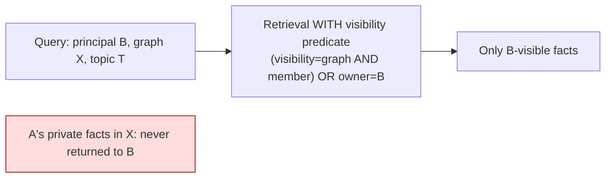

# 11_MEMORY_CONTEXT_VISIBILITY.md
## Hypermind Track B — Memory / Context / Visibility

**Package:** subsystem doc 11 of 17 · **Depth:** deep · **Status:** implementation contract
**Authority:** subordinate to `00_CANONICAL_PRD`. Realizes MEM-001..006, VAULT-001..005, RAUTH-003 (visibility), EMO-002/004 (no emotional content). Uses `Mem0Fact`/`VaultDocument` (`01` §5); every read is gated by `04`.
**Consumed by:** `05` (context hydration), `04` (visibility filter target), `02` (memory/vault endpoints), `14`/`17`.

**Label legend:** `[LOCKED]` · `[IMPL]` · `[FUTURE]` · `[OPEN — OWNER]`.

---

## 0. The two rules this document exists to enforce

> **1. Three layers, never merged.** Session state ≠ Mem0 ≠ Knowledge Vault. (MEM-001, VAULT-004)
> **2. A user's private memory in a shared graph is not visible to other members just because they share the graph.** (RAUTH-003)

Rule 2 is the same private-vs-graph-shared guarantee as `04`, applied to the specific store most likely to leak it. This document is where memory retrieval physically enforces it.

---

## 1. The three layers (MEM-001, never merged)

| Layer | Nature | Storage | Lifetime | Visibility |
|---|---|---|---|---|
| **Session memory** | volatile current conversation/task state | in-memory (runtime, `05`) | the task/session; discarded after | the acting principal only |
| **Mem0** | persistent, per-user/graph-relevant long-term memory | ChromaDB `hypermind_memories` + SQLite | until user deletes | **visibility triplet** (RAUTH-003) |
| **Knowledge Vault** | static/shared curated knowledge | ChromaDB `hypermind_vault` (distinct client) + git-backed markdown | curated | shared-by-construction (no per-user visibility) |

`[LOCKED]`
- **Distinct Chroma collections + distinct client objects** (VAULT-003): `hypermind_memories` and `hypermind_vault` are never the same collection or variable in any file. A PR pointing both at one collection is merge-blocking — that's the single mistake that would merge personal memory into shared knowledge.
- **The moment session state would be written to disk/DB, it belongs in Mem0** (with a visibility decision), not smuggled into a persistent store as "session."
- Mem0 and Vault are never merged into one schema/store (VAULT-004).

---

## 2. Mem0 visibility model (RAUTH-003 — THE leak-prevention rule)

Every `Mem0Fact` (`01` §5.1) carries the visibility triplet: `owner_user_id`, `source_user_id`, `visibility ∈ {private, graph}`, plus `graph_id`.

`[LOCKED]` **The retrieval predicate** (identical to `04`'s `readable()`):
```
mem0_readable(user, fact) :=
    fact.visibility == "graph"  AND  active_member(user, fact.graph_id)
 OR fact.owner_user_id == user
```
- **Default `private`** (RAUTH-005): a fact formed while a user works in a shared graph is theirs alone unless they explicitly share it.
- **`graph_id` alone never authorizes a read** — presence of `graph_id` is scoping, not authorization.
- **The visibility filter is applied at query time, inside the retrieval call** — not as an afterthought in the caller. A Mem0 query for principal B in graph X returns only facts satisfying `mem0_readable(B, fact)`; another user's `private` facts in X are physically never in the result set (not fetched-then-filtered-in-the-app where a bug could leak them — filtered in the query, `[REC]`).



---

## 3. Context hydration (MEM-002 — relevant, not lifetime-dump)

`[LOCKED]` Mem0 is **not** "load the whole history into every model context." Hydration for a request (GRAPH-004, MEM-002):
```
CURRENT REQUEST → GRAPH/TASK CONTEXT → RELEVANT MEMORY RETRIEVAL (visibility-filtered §2)
→ RELEVANT VAULT KNOWLEDGE → MODEL CONTEXT
```
- Retrieval is **relevance-bounded** (top-K by semantic relevance to the current task), not exhaustive.
- Everything hydrated is **within the principal's authorization** (§2) — so the agent's context can never contain another user's private data (this is what makes `05`'s confused-deputy prevention actually hold at the memory layer).
- `[IMPL]` the exact K / relevance strategy; `[LOCKED]` that hydration is bounded and visibility-filtered.

---

## 4. Memory write policy (MEM-003/004)

`[LOCKED]`
- **What gets written:** only **task-relevant** facts — `fact_type ∈ {preference, past_request, stated_goal}` (`01` §5.1). Memory does not store everything that happened merely because it happened (MEM-003).
- **Never emotional/relationship content** (MEM-004, EMO-002): the `fact_type` enum is the structural guard — a fact that would need a type outside the enum is rejected, not coerced. No agent-mood, no relationship state, no "I care about you"-adjacent content is storable. (Ties the EMO hard line, `00` §23.)
- **Default visibility `private`** on write (RAUTH-005); sharing is a separate explicit act (§6).
- **Provenance:** `source_user_id`, `source_session_id`, timestamp recorded.

---

## 5. Retrieval, correction, deletion (MEM-003)

`[LOCKED]`
- **Retrieval:** visibility-filtered (§2), relevance-bounded (§3).
- **Correction:** the **owner only** may correct a fact's content (`02` PATCH /memory). Corrections are audited.
- **Deletion:** the **owner only** may delete (`02` DELETE /memory); a member cannot delete another user's fact even in a shared graph (D3 ownership, `04`).
- **User visibility:** a user can see and manage their own memories (own + facts shared to graphs they're in), via `02` GET /memory — visibility-filtered like everything else.
- **Account/graph deletion** (LIFE-003, ties `04` §4.4): deleting an account removes that user's memories; deleting a shared graph removes graph-shared facts but **never** a member's private facts scoped there (they follow the member's data lifecycle).

---

## 6. Sharing a memory (explicit, owner-only, audited — RAUTH V2)

`[LOCKED]` Changing a fact's `visibility` from `private → graph` is owner-only, explicit, and emits an `AuditEvent` (RAUTH V2). It is never a side effect. Un-sharing (`graph → private`) is the same. **Sharing a graph never shares secrets** (GRAPH-009) — a `Mem0Fact` never contains secret material (that's the SecretStore, `12`), and sharing a memory never exposes a credential.

---

## 7. Knowledge Vault (VAULT-001..005)

`[LOCKED]`
- Static/shared/curated, separate collection (§1), queried via `02` GET /vault/query (RAG top-K).
- Vault content has **no visibility triplet** — it is shared-by-construction (curated knowledge, not user data). It therefore never carries per-user private data; a curator must not put user-specific/private content into the vault.
- Vault **grants no credentials, bypasses no authorization** (VAULT-004). It does not silently merge into Mem0.
- MVP content: general product/task knowledge, tone/style guides (bounded by EMO), **no finance/health/education domain content** (VAULT-005 — that's a future Intelligence Provider, `00` §25).
- Who may modify: `[IMPL]`/owner-defined curators; modifications audited.

---

## 8. Cross-user isolation as a testable property (MEM-005)

`[LOCKED]` Per-user/per-graph memory separation is **not an assumed property** — it is a release-blocking acceptance requirement (`00` §39 #22). The test: principal B, member of shared graph X, cannot retrieve principal A's `private` fact in X through any memory query, hydration path, or agent action. This is verified, not trusted (§10).

Interaction with **OD-A1** (`14`): §2's filter provides **logical** isolation. Whether a compromised application process under RCE could bypass the query filter and read the underlying store directly is the OD-A1 question — this document provides the logical guarantee and defers the physical-isolation question to `14`. It does not claim physical isolation.

---

## 9. Open items

| ID | Question | Status |
|---|---|---|
| OD-MEM-1 | hydration relevance strategy (K, ranking) | `[IMPL]`; bounded+filtered constraint locked |
| OD-MEM-2 | embedding model for Mem0/Vault | `[IMPL]`; local-first `[REC]` (e.g. bge-small, consistent with PRD Mem0 config) |
| OD-AUTHZ-1 (from `04`) | shared facts on graph-leave: stay or auto-unshare | `[OPEN — OWNER]`; rec stay |
| OD-A1 (PRD) | physical isolation of Mem0 store under RCE | → `14` |

---

## 10. Acceptance hooks (for `17`)

- **MEM-T1** principal B cannot retrieve A's `private` Mem0 fact in a shared graph, via query, hydration, or agent (RAUTH-003, MEM-005). *(release-blocking — the memory-leak test)*
- **MEM-T2** a new memory defaults to `visibility: private` (RAUTH-005).
- **MEM-T3** a `fact_type` outside {preference, past_request, stated_goal} is rejected (EMO-002).
- **MEM-T4** no emotional/relationship content can be stored (EMO-004).
- **MEM-T5** only the owner can correct/delete/share a fact (D3).
- **MEM-T6** `hypermind_memories` and `hypermind_vault` are distinct collections + clients (VAULT-003).
- **MEM-T7** vault query never returns a user's private memory; memory query never returns raw vault-as-user-data (separation).
- **MEM-T8** hydration is relevance-bounded, not a full-history dump (MEM-002).
- **MEM-T9** deleting a shared graph does not delete a member's private facts (§5, ties `04`).
- **MEM-T10** changing visibility to `graph` emits an AuditEvent (RAUTH V2).

---

*End of 11_MEMORY_CONTEXT_VISIBILITY. Continues to 12 (DEEPEST).*
