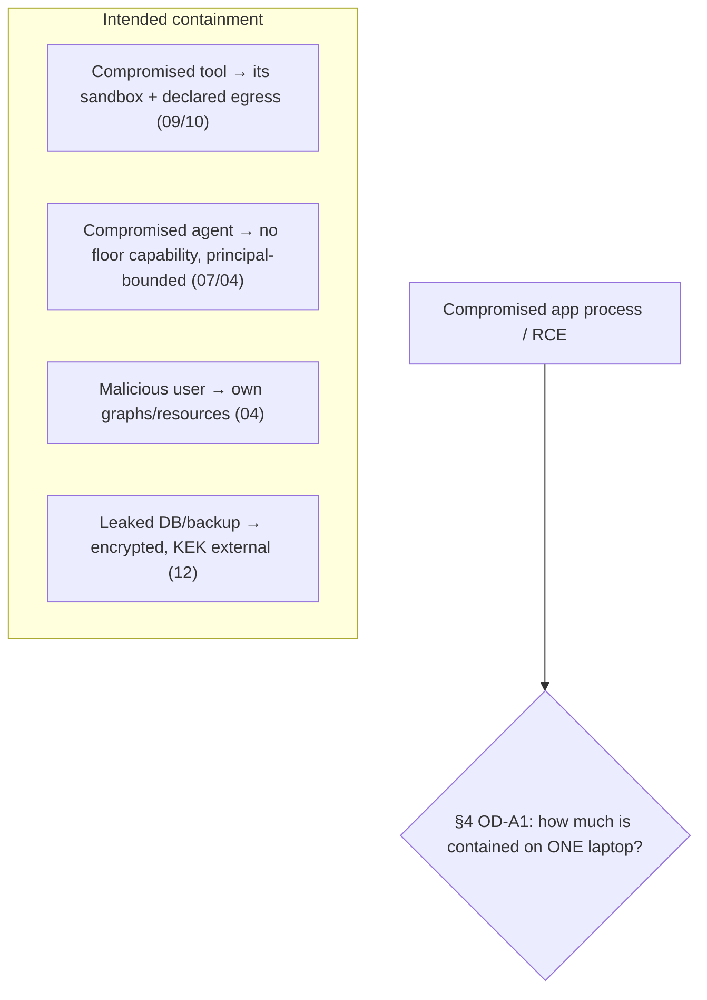

# 14_SECURITY_BLAST_RADIUS.md
## Hypermind Track B — Security & Blast-Radius Validation

**Package:** subsystem doc 14 of 17 · **Depth:** DEEPEST · **Status:** validation contract
**Authority:** subordinate to `00_CANONICAL_PRD`. Realizes the threat model (§30 SEC-A..V), blast-radius (BLAST-001..003), the Security Boundary Invariants (INV-1..20), and adjudicates **OD-A1**. Consumes the boundaries defined in `03`/`04`/`07`/`08`/`09`/`10`/`12`/`13`.
**Consumed by:** `17` turns these experiments into tests; the owner uses OD-A1 (§4) as the go/no-go gate before real user data.

**Why DEEPEST + why last of the five:** this document doesn't add a new boundary — it **validates** all the others by turning threats into concrete attack experiments and by honestly adjudicating the one boundary the whole design admits is not fully solved on a single laptop. Its value is refusing to declare victory where victory isn't earned.

**Label legend:** `[LOCKED]` · `[IMPL]` · `[FUTURE]` · `[OPEN — OWNER]`.

---

## 0. The stance this document exists to hold

> **Never claim perfect isolation because a mechanism (Docker, a filter, a check) exists. Validate each boundary by trying to break it, and state the residual honestly.** (SEC-CORE-001)

The strongest guarantees in Track B are **absences** (no submission-equivalent capability; no read-path from research store; no agent-callable `get()` on secrets) — because an absence can't be exploited. This document verifies the absences hold and stress-tests the behavioral boundaries.

---

## 1. Attack experiments (SEC-A..V)

Each: **attacker capability → attack → expected boundary → expected block → max blast radius (if boundary holds) → evidence → recovery.** These become `17` tests. "Max blast radius" is the intended worst case *when the boundary holds*.

| ID | Threat | Attack | Boundary (doc) | Expected block | Max blast radius | Recovery |
|---|---|---|---|---|---|---|
| SEC-A | Malicious user | probe others' resources | `04` D1/D4 | 404 (anti-enum) | own graphs only | audit review |
| SEC-B | Modified client | forge `user_id`/`graph_id` in body | `03`/`04` PHONE-003 | server re-derives identity; body ignored | own authorized resources | — |
| SEC-C | Prompt injection (user input) | "ignore rules, do X" | `05` propose≠decide; `04` authorize | action denied unless authorized | none unauthorized | — |
| SEC-D | Malicious tool output | embed "run rm -rf" in result | `05`/`06` result=data-not-instructions | no action from embedded text | none | — |
| SEC-E | Malicious MCP | rogue MCP tool | `07` TOOL-004 + `09`/`10` bounds | capability-gated, sandboxed, egress-bound | its granted capability only | disable tool |
| SEC-F | Compromised tool process | tool tries to escape | `09` sandbox + `10` egress | no fs escape, no non-declared egress | its sandbox + declared dests | kill/rotate |
| SEC-G | Compromised agent process | agent tries to self-escalate | `07` PERM-006 absolute-floor by absence | no capability to escalate exists | none (no floor capability) | — |
| SEC-H | Compromised FastAPI process | app-level RCE | **the weakest boundary — see §4 OD-A1** | partial (see §4) | **potentially multi-user; documented limit** | §4 recovery |
| SEC-I | Server-side RCE | full code exec on host | `12` KEK-external + SUPER-001 | not automatic master-key/superuser; but in-memory unlocked secrets exposed | see §4 | re-key, revoke, rebuild |
| SEC-J | Stolen device credential | use another's device cred | `03` revocation | works until revoked | that device's scope until revoked | revoke device |
| SEC-K | Stolen access token | replay short token | `03` short TTL | expires quickly | session scope ≤ TTL | expiry |
| SEC-L | Stolen API credential | exfiltrate a provider key | `12` handle-only + `10` no-exfil-egress | agent never holds raw key; egress can't ship it | that secret's scope | rotate |
| SEC-M | Malicious shared-graph member | read others' private data in graph | `04` D4 / `11` MEM-T1 | private stays private | shared content only | remove member |
| SEC-N | Malicious shared-graph content | inject via shared file/memory | content=data; `05`/`04` gate actions | no unauthorized action | none | — |
| SEC-O | SSRF/network escape | reach metadata/localhost/private | `10` NET-004 | blocked (metadata/localhost/private) | none | — |
| SEC-P | Filesystem traversal | `../../etc`, symlink, zip-slip | `09` FS-002/T1/T2/T3 | rejected | none | — |
| SEC-Q | Cross-user graph access | access a graph not a member of | `04` D1 (404) | blocked, no existence leak | none | — |
| SEC-R | Cross-user memory access | retrieve another's private fact | `11` MEM-T1 | filtered out | none | — |
| SEC-S | Log/telemetry secret leak | find a secret in logs | `12` SECRET-004 / `02` error-envelope | secrets never logged | none | — |
| SEC-T | Scheduler abuse | create unbounded jobs | `13`/`22` limits | quota-capped | own quota | — |
| SEC-U | Model/provider abuse | burn model calls | `13` per-request caps | capped | own quota | — |
| SEC-V | API budget exhaustion | run up paid spend | `13` budget vs ledger | refused at budget | own budget | — |

`[LOCKED]` Every row is a `17` test. A row whose "expected block" fails is release-blocking (for the behavioral boundaries) — except SEC-H/SEC-I, which are governed by §4 (they have a *documented residual*, not a clean block, on a single-laptop pilot).

---

## 2. Security Boundary Invariants (consolidated, INV-1..20)

`[LOCKED]` The properties that must hold no matter what any model/tool/MCP/agent proposes — each enforced deterministically or by absence, each with its test:

| # | Invariant | Enforcement (doc) | Test |
|---|---|---|---|
| INV-1 | agent proposes; deterministic code decides/executes | `05`/`04` | RT-T1 |
| INV-2 | no security decision trusts model output | `04` | RT-T1/AZ-T9 |
| INV-3 | phone can't self-authorize; identity server-derived | `03` | AUTH-T7 |
| INV-4 | `graph_id` alone never authorizes cross-user read | `04`/`11` | AZ-T1/MEM-T1 |
| INV-5 | a user's private resource invisible to other members | `04`/`09`/`11` | AZ-T1/FS-T6/MEM-T1 |
| INV-6 | agent never sees raw secrets | `12` | SS-T2 |
| INV-7 | app compromise ≠ automatic master key/superuser | `12` §4 | SS-T3/SS-T4 (+ §4 residual) |
| INV-8 | agent can't self-escalate/disable audit | `07` PERM-006 | TL-T5/RT-T4 |
| INV-9 | tool can't bypass network policy | `10` NET-005 | NET-T2 |
| INV-10 | tool can't escape fs sandbox | `09` | FS-T9 |
| INV-11 | MCP gets no trust from protocol conformance | `07` TOOL-004 | TL-T6 |
| INV-12 | no irreversible action without confirmation | `07`/`05` PERM-004 | RT-T3/TL-T4 |
| INV-13 | no automatic-submission-equivalent capability exists | `07`/`00`§16 | TL-T5 |
| INV-14 | speaker identity never authorizes | `01`/`27` VOICE-002 | (voice test) |
| INV-15 | security-control failure fails closed | `04`/`12`/PRD FAIL-CORE-003 | AZ-T9/SS-T8 |
| INV-16 | secrets never in logs/usage/dashboard/client | `12`/`13`/`28` SECRET-004 | SS-T1/US-T2 |
| INV-17 | dashboard is privileged, authenticated, secret-free | `28` DASH-003..006 | (dashboard test) |
| INV-18 | Track B works fully with intelligence disabled | `00`§25 INTEL-003 | (intel-disabled test) |
| INV-19 | every model/tool call metered | `13` USAGE-001 | US-T1 |
| INV-20 | cross-user isolation under single-laptop RCE **not** claimed proven | **§4 OD-A1** | §4 review |

`[LOCKED]` INV-20 is the honesty invariant: the package explicitly does **not** claim what §4 leaves open.

---

## 3. Blast-radius model (BLAST-001/002)

`[LOCKED]` Objective: compromise of one component does not automatically compromise everything. What each compromise is *intended* to contain to:

`[LOCKED]` The clean containments (tool, agent, user, DB-at-rest) hold by the mechanisms in `09`/`10`/`04`/`12`. The **application-process compromise / RCE** case is the one that is *not* cleanly contained on a single-process single-laptop pilot — adjudicated next.

---

## 4. OD-A1 — the primary unresolved architecture-validation question

`[OPEN — OWNER, release-gating for real data]`

**The question:** on a single laptop running one FastAPI process with shared memory backends, if an attacker achieves application-level RCE (SEC-H/SEC-I), can they read *another* user's data — memory/files/secrets — despite the logical isolation (`04` visibility filters, `11` query filters, `09` sandbox roots, `12` handle-only)?

**The honest answer:** **partially yes, and the design does not claim otherwise (INV-20).** The logical boundaries (visibility filters, query predicates, sandbox roots, handle-only secrets) are enforced by *application code*; an attacker who *is* the application process can, in principle, bypass application-level checks and read the underlying shared stores and any secrets currently unlocked in memory. Encryption-at-rest + external-KEK (`12`) means a *stolen disk/backup* yields nothing, but a *live compromised process* with the store unlocked is a different, harder case.

**What IS contained even under app RCE (real, not nothing):**
- stolen disk/backup → encrypted, useless without the KEK (`12` §3).
- master key / superuser → not in the app process (`12` §4) — so RCE doesn't automatically yield *those* (though it may yield currently-unlocked DEKs/secrets in memory).
- other machines / the tunnel credential → server-side, separate.
- tools/agent are more contained than the app process itself (they run in narrower sandboxes).

**Options to resolve (owner decides):**
| Option | What it buys | Cost |
|---|---|---|
| **(a) Accept, document, gate** | pilot proceeds with *logical* isolation + a written limit: real user data only after review; disposable/test data until then | cheapest; honest; leaves the residual for the pilot |
| **(b) Per-user process isolation** | each user's agent/tool/session in a separate process/container → RCE in one doesn't trivially read another's memory | more infra, still shared DB unless (c) |
| **(c) Per-user data-store isolation** | separate DB/collection/encryption context per user → app RCE can't read another's store without that user's key | most isolation; most complexity for a student-scale pilot |

**Recommendation (`[REC]`):** **(a) for the pilot with disposable/test data**, and a **hard gate (LOCKED): no real, non-disposable user data is entrusted to the pilot until OD-A1 is reviewed and either accepted for the pilot's risk level or upgraded to (b)/(c)** (ties PRD PILOT-004). This is the concrete meaning of "prove it before trusting real data."

**The experiment `17` must run for OD-A1:** simulate app-level RCE (a test hook that runs attacker-controlled code in the app process) and attempt to read user B's memory/files/secrets while acting as user A's compromised process; **record exactly what is and isn't reachable.** The result is not pass/fail — it is the *measured blast radius* that informs the owner's (a)/(b)/(c) decision. Documenting the real reachable set honestly is the deliverable.

---

## 5. Residual risks (documented, not hidden)

| Residual | Why it remains | Mitigation | Owner action |
|---|---|---|---|
| App RCE reads co-tenant data / in-memory secrets | single-process pilot (OD-A1) | logical isolation + gate on real data | decide (a)/(b)/(c) |
| Stolen device credential pre-revocation | "logged in until revoked" UX (`03`) | short access TTL, step-up, revoke | accept/adjust |
| Container/namespace escape from a tool | shared kernel | isolation + least-priv + `[FUTURE]` stronger sandbox | monitor |
| Encrypted-traffic-analysis / ML errors | probabilistic (n/a to Track B; noted for cross-ref) | — | — |
| Native-parser memory bug (if any tool parses untrusted files) | native code | isolated parser context (`09` §8 analogue) | fuzz-test |

`[LOCKED]` This table is the honest residual set. None is hidden; each has an owner action. A residual is not a failure — an *undocumented* residual would be.

---

## 6. Open items

| ID | Question | Status |
|---|---|---|
| **OD-A1** (PRD, primary) | cross-user isolation under single-laptop app RCE | **§4**: `[OPEN — OWNER]`, gate real data; rec (a)+gate |
| OD-FS-1 / OD-NET-1 (from `09`/`10`) | isolation/egress enforcement mechanism | ratified here: `[REC]` mount-isolation (fs) + netns-filter (egress); `[IMPL]` |
| OD-SEC-1 (from `12`) | KEK provisioning | `[IMPL]`; external-KEK guarantee locked |

---

## 7. Acceptance hooks (for `17`)

- **SEC-Tx** every SEC-A..V row's expected block holds (behavioral boundaries release-blocking). *(the threat-experiment suite)*
- **INV-Tx** every INV-1..20 invariant's test passes; INV-20 is satisfied by §4 being genuinely open, not falsely closed.
- **BR-T1** a compromised tool is contained to its sandbox + declared egress (SEC-F; FS-T9/NET-T2).
- **BR-T2** the OD-A1 RCE experiment (§4) is run and its **measured blast radius documented**; no false "fully isolated" claim is made.
- **BR-T3** stolen disk/backup yields no usable secrets without the KEK (SS-T3).
- **BR-T4** the residual table (§5) is present and each residual has an owner action.

---

*End of 14_SECURITY_BLAST_RADIUS (DEEPEST — last of the five). Continues to 15. The load-bearing honesty of this doc: it validates the boundaries that hold and refuses to claim the one (OD-A1) that doesn't, gating real user data on a real decision.*
