# 26_DECISION_PROVIDER.md
## Hypermind Track B — DecisionProvider (Advisory Runtime-Control Signal)

**Package:** future-band document — **not** part of the ratified `01`–`17` subsystem sequence and **not** listed in `TRACK_B_ARCHITECTURE_INDEX.md`'s package structure. Proposed slot **`26`**, chosen because it is the nearest unclaimed number to `25` (IntelligenceProvider) — see §1.1 for how the numbering was verified.
**Depth:** compact-to-deep (the substance is an interface/boundary contract, not a new execution mechanism — same reason `06` is "compact").
**Status:** **`[FUTURE]` `[OPTIONAL]` `[PROPOSED / PENDING PRD RATIFICATION]`** — this entire document is a proposal. Nothing in it is canonical until the owner ratifies it into `00_CANONICAL_PRD`.
**Authority:** subordinate to `00_CANONICAL_PRD` — which, as of this writing, **is absent from this repository** (confirmed: not present under any filename, not present anywhere in git history). This document therefore introduces **no PRD-ratified requirement IDs**. Every identifier it proposes (`DP-*`, a candidate `INV-21`, a candidate `SEC-W` row, a candidate `usage.kind: decision_call` enum value) is a **proposal**, tagged `[OPEN — OWNER]`, not a locked contract. **Subsystem documentation cannot silently modify or override the canonical PRD** (per `TRACK_B_ARCHITECTURE_INDEX.md`'s own source-of-truth rule) — this document does not attempt to; where it would touch `[LOCKED]` material in `05`/`06`/`13`/`14`/`16`/`17`, it says so explicitly and proposes the edit as a follow-up for owner review rather than applying it.
**Consumed by:** **no one, currently.** The MVP runtime (`05`) does not call this interface; `02`'s endpoint surface does not expose it. It exists so that *if* Phase 3+ introduces advisory decision signals, the socket is already designed and does not require rebuilding `04`/`05`/`07`/`09`/`10`/`12`.

**Label convention for this document:** because nothing here is ratified, this document does **not** use `[LOCKED]` (that label means "part of the canonical build" everywhere else in the package). It uses `[PROPOSED]` where the rest of the package would say `[LOCKED]` — i.e. "this is the constraint I'm asking the owner to lock, if and when this is ratified" — plus the package's ordinary `[IMPL]`, `[FUTURE]`, `[OPEN — OWNER]`.

---

## 0. The one sentence this document exists to enforce

> **A DecisionProvider may inform routing; it may never become authority.**

Everything below is the precise version of that sentence: where the boundary with the existing LLM-as-Tool architecture (`06`/`07`) sits, what a DecisionProvider is allowed to influence, what it can never touch, and how its failure modes are handled without weakening `04`'s deterministic authorization engine or `05`'s determinism boundary.

---

## 1. Governance status

### 1.1 Numbering verification (done before this document was written)

- `TRACK_B_ARCHITECTURE_INDEX.md`'s declared package structure lists only `00`–`17`; nothing beyond `17` is part of the ratified package.
- `21`, `22`, `25`, `27`, `28` are cited *inside* prose across `02`, `05`, `07`, `13`, `14`, `15`, `16` as forward-references to not-yet-written companion material (`21`→a vault reference that is actually owned by `11`; `22`→Scheduler; `25`→IntelligenceProvider; `27`→Voice; `28`→Dashboard). None of the five has an actual file in this repository, and none is listed in the index. This is a pre-existing gap in the package (dangling forward-references) — **this document does not attempt to fix that**; it is out of scope here.
- `18`, `19`, `20`, `23`, `24`, `26`, and everything `≥29` are cited **nowhere** in the package.
- **`26` is chosen** as the proposed slot: it is unclaimed, and it sits immediately beside `25` (IntelligenceProvider) — the adjacent abstraction this document most needs to be read next to (§14).
- This document does **not** renumber, rewrite, or add an index entry for any existing doc. Per the package's own convention — `21`/`22`/`25`/`27`/`28` are referenced repeatedly but never got an index row — a forward-referenced-but-unratified document is *not* added to the index's package-structure block or status ledger. This document follows that same convention: **the index is not modified.** If the owner ratifies this document, adding it to the index (and giving it a firm number) is the natural follow-up edit — proposed here, not performed.

### 1.2 What this status means operationally

- **Not currently canonical pilot architecture.** No pilot deployment, no MVP acceptance criterion, and no release-blocking test in `17` depends on a DecisionProvider existing.
- **Optional forever, not just at launch.** Track B's architecture must work with `decision_provider.enabled: false` indefinitely — this is not a bootstrapping phase that later becomes mandatory (mirrors the existing `intelligence.enabled: false` posture in `15`/`INV-18`).
- **Pending PRD ratification.** Until the owner ratifies a DecisionProvider concept into `00_CANONICAL_PRD`, this document is read as *proposed architecture*, consulted the way an engineer would consult a design doc for unbuilt work — not as a contract anyone is out of compliance with.

---

## 2. What this document is not allowed to do

Per the package's own source-of-truth rule, this document:
- does not modify `00_CANONICAL_PRD` (which is, in any case, not present in this repository to modify);
- does not weaken, loosen, or silently amend any `[LOCKED]` rule in `01`–`17` — see §5, §9, §11 for the specific passages that a *future* ratification would touch, presented as proposed edits, not applied ones;
- does not add `DecisionProvider` to the index's package structure or status ledger (§1.1);
- does not invent a new execution/runtime stack — §4 explicitly reuses `06`'s `ModelProvider` plumbing where applicable.

---

## 3. The three abstractions — do not collapse them

`[PROPOSED]` Track B, if it ever adds advisory-decision infrastructure, must keep three abstractions distinct rather than merging them into a generic "AI provider":

| Abstraction | What it is | Owning doc(s) | Output trust |
|---|---|---|---|
| **ModelProvider** (`06`) | general model execution / reasoning / generation | `06` | untrusted content (§4 of `06`) |
| **DecisionProvider** (this doc) | typed **advisory** signal consumed by *deterministic runtime control flow* | this doc (`26`) | untrusted signal — interpreted by deterministic policy, never itself authoritative |
| **IntelligenceProvider** (referenced as `25`) | domain-specific intelligence capability (finance/health/education-class reasoning), disabled by default (`INTEL-003`) | `02 §11`, `15`, referenced-but-unwritten `25` | out of scope here — see §14 |

A DecisionProvider is **not** a weaker IntelligenceProvider and **not** a renamed ModelProvider. An IntelligenceProvider may internally use models, tools, classifiers, search, validation, or future Darwin-style mechanisms — Track B does not depend on those internals, and neither does this document.

---

## 4. Reconciliation #1 — DecisionProvider vs LLM-as-Tool (call-site is the distinction)

`[PROPOSED]` The boundary with the existing `06`/`07` LLM-as-Tool architecture is defined by **call site**, not by the underlying model technology. The same small model could sit behind either interface — what differs is *who calls it and why*.

```mermaid
flowchart TB
    subgraph CS1["Call site 1 — agent proposes a model call"]
        AG["Agent (05)"] -->|proposal| MT["Model-as-Tool / LLM-as-Tool (06/07)"]
        MT --> CAP["capability-gated, registered ToolContract, metered (07/13)"]
        CAP --> OUT1["output = untrusted data back into agent context (06 §4)"]
    end
    subgraph CS2["Call site 2 — deterministic runtime consults an advisory signal"]
        RT["Deterministic runtime control-flow (05)"] -->|consult| DP["DecisionProvider.decide()"]
        DP --> SIG["typed signal, schema-validated"]
        SIG --> POL["deterministic policy interprets signal"]
        POL --> DEC["deterministic runtime makes the actual decision"]
    end
```



| | Call site 1: LLM-as-Tool (`06`/`07`) | Call site 2: DecisionProvider (this doc) |
|---|---|---|
| Who initiates the call | the **agent**, as a proposal | the **deterministic runtime**, as part of its own control flow |
| Governing doc | `06`/`07` | this doc |
| Gating | capability-gated, registered `ToolContract`, `04`-authorized | not capability-gated in the `07` sense — it is not an action the agent is requesting, it is an input the runtime consults (still metered, egress-bound, secret-boundary-bound — §9) |
| Output disposition | untrusted data returned **into the agent's context** | untrusted **signal** consumed **by deterministic policy** — never returned to the agent as ground truth, never re-enters as a "fact" |
| What it can affect | what the agent proposes next (the agent may act on it, subject to the same `04`/`07` gates as any observation) | which non-security control-flow branch the *runtime itself* takes (§5) |

`[PROPOSED]` Legitimate future DecisionProvider uses (all non-security, all overridable by the deterministic layer, none of them themselves a security decision):
- model/tool routing (which configured model-tool or primary-model variant handles this step)
- escalation selection (whether to hand off to a stronger/more expensive model)
- workload classification (rough shape of the request, for routing only)
- context/hydration filtering — **ranking among already-authorized candidates only** (§13; never a visibility bypass)
- non-security prioritization (queue ordering, not access)
- prompt-injection suspicion detection (§6 — asymmetric: may raise caution, never clears it)
- deciding whether a request should be escalated to a stronger model
- deciding which IntelligenceProvider candidate (if any, and if enabled) should be consulted

`[PROPOSED]` A DecisionProvider **may** be implemented using an existing `ModelProvider` adapter (`06`). Do not invent a separate model-execution stack merely because the conceptual interface differs:

```
DecisionProvider
     |
     +-- local typed classifier
     |
     +-- grammar-constrained small model
     |
     +-- ModelProvider adapter (06) — reused, not reinvented
     |
     +-- remote decision service
```

The `DecisionProvider` *contract* (§7) stays distinct from `ModelProvider` precisely because its **call site** and **runtime semantics** differ (§5), not because it needs different plumbing underneath. Implementations are free — and encouraged — to front a `ModelProvider` adapter behind a `DecisionProvider` wrapper that adds schema validation, decision-class typing, and the failure semantics of §8.

---

## 5. Reconciliation #2 — the determinism boundary (ties `05`)

`05 §0` states the runtime's governing rule: *"The agent proposes; deterministic infrastructure decides and executes; the human confirms where the risk model requires it."* `05 §11` then tabulates exactly what the runtime owns (deterministic) vs. what the model owns (proposes only) — and states, `[LOCKED]`, that "nothing in the left column is ever delegated to the model."

**This document does not touch that table.** It proposes one narrow, additive qualification for the owner to apply to `05 §11` on ratification:

> `[PROPOSED — for owner application to 05 §11, not applied by this document]`: the runtime's left-hand ("deterministic") column may, for a bounded, enumerated set of **non-security** control-flow decisions, consult a DecisionProvider's typed advisory signal as one input. The decision itself — which branch is taken — remains runtime-owned. The DecisionProvider does not move to the right-hand ("model proposes") column, and it is not a new actor between the two columns: it is an input the deterministic column may read, exactly as it already reads a rate-limit counter or a config flag.

The required phrasing, and the phrasing this document forbids:

| Forbidden phrasing | Required phrasing |
|---|---|
| "the DecisionProvider makes the routing decision" | "the DecisionProvider provides advisory routing **evidence** / an advisory **signal**; the deterministic runtime owns the resulting decision" |
| "DP decides whether to escalate" | "DP's signal is one input; deterministic policy decides whether to escalate" |

`[PROPOSED]` Two categories, and only one may ever consume a DecisionProvider signal:

| Category | Examples | May consult DP? |
|---|---|---|
| **Non-security control flow** | model selection, escalation, prioritization, context/candidate selection (ranking only, §13), cost/latency optimization | **Yes** — this is the entire scope of legitimate DP use |
| **Security / authorization control** | permissions, capability grants, identity, confirmation requirements, security floors (`PERM-006`), secret access, isolation (`09`/`10`), network authorization | **No, never** — these remain exclusively governed by `03`/`04`/`07`/`09`/`10`/`12`, unconditionally, regardless of what any DecisionProvider signal says |

This is the same shape as the existing `04`/`05` confused-deputy and fail-closed guarantees: a new *input* to the deterministic layer does not create a new *locus of authority*. `04`'s five-dimension algorithm, `07`'s capability chain, and `12`'s handle-only secret access are **unconditional** with respect to any DecisionProvider output — there is no code path in which a DP signal substitutes for a `PermissionDecision`.

---

## 6. Security asymmetry — suspicion signals are not symmetric with clearance

`[PROPOSED]` For prompt-injection detection or any other suspicion/classification use of a DecisionProvider, the semantics are **structurally asymmetric**, not a two-way dial:

**A DecisionProvider MAY:**
- raise caution
- flag content/a request as suspicious
- trigger stronger inspection
- trigger escalation (to a human, to a stronger model, to additional validation)

**A DecisionProvider MUST NOT:**
- clear a suspicion once raised by any other mechanism
- remove or weaken an existing security control
- downgrade an already-enforced containment decision
- authorize an unsafe action, or make an unsafe action confirmable/automatic that would otherwise be denied/prohibited

```
DP says "suspicious"  →  deterministic runtime MAY escalate (non-security control-flow decision)
DP says "clean"       →  deterministic runtime CONTINUES applying its existing containment/policy unchanged;
                          "clean" is never treated as a security authorization or a reason to relax anything
```

This is what "fail-closed" (`INV-15`) means applied to an advisory signal: **absence of a red flag is not a green light.** The deterministic containment and authorization layers (`04`/`07`/`09`/`10`/`12`) are exactly as strict whether or not a DecisionProvider ran, whether or not it is even configured, and regardless of what it reports when it does run.

---

## 7. Interface (illustrative, not locked)

`[PROPOSED, OPEN — OWNER on exact fields]`

```
interface DecisionProvider:
    decide(request: DecisionRequest, decision_class: DecisionClass) -> DecisionResult | rejected
    health() -> ok | unavailable
```

Illustrative shape only — exact fields, confidence semantics, and thresholding are explicitly **not** decided here (§19 OD-DP-1/2/3):

```
DecisionRequest  { decision_class, candidate_options[], bounded_context, request_id }
DecisionResult   { decision_class, selected_option | signal_value, confidence?, schema_version }
```

`[PROPOSED]` **Typed/schema validation is mandatory.** A malformed or schema-invalid `DecisionResult` is **rejected**, not coerced. In particular: free-form natural-language output is never silently parsed into a trusted decision value. This is stricter than `06`'s "model-tool output is untrusted data" rule (which still lets the agent see the data) — here, an invalid response doesn't even become a signal; it is treated as if the DecisionProvider were unavailable (§8) and logged as a validation failure.

Every field of `DecisionRequest`/`DecisionResult`, the `DecisionClass` enum's membership, and the confidence semantics are `[OPEN — OWNER]` — this document deliberately does not settle them (§19).

---

## 8. Failure semantics — by decision class, not one ambiguous flag

`[PROPOSED]` Failure behavior is **not** a single field like `failure_policy: fail_closed_or_escalate`. It is structurally determined by `decision_class`:

| `decision_class` | Failure trigger | Required behavior |
|---|---|---|
| **security-adjacent** (e.g. prompt-injection-suspicion feeding an escalation decision, any classification whose output could plausibly be read as touching a security property) | unavailable, malformed, timeout, unauthorized, invalid | **fail closed with respect to the security property** — treated as "no advisory signal produced"; the deterministic containment/policy that would apply with *no* DecisionProvider configured at all is exactly what applies. Never treated as "clean." |
| **non-security routing** (model selection, escalation-for-quality, prioritization, cost/latency optimization) | unavailable, timeout, unsupported, invalid | **deterministic fallback or escalation** is permitted — e.g. fall back to the default configured model/route (mirrors `05 §5`'s existing model-fallback rule: the *fallback decision* is deterministic, never model-decided) |

The distinction is structural (which `decision_class` a signal belongs to determines its entire failure contract), not a runtime toggle an operator could misconfigure into the wrong behavior for a security-adjacent signal.

---

## 9. No special exception — inherits every existing boundary

`[PROPOSED]` A remote DecisionProvider is a **networked component**. It gets no exception because "it's only a classifier":

- **Egress** (`10`): a remote DP endpoint is a declared destination like any other network-capable tool — default-deny, explicit allowlist, SSRF/metadata/localhost/private-range protections, DNS-rebinding defense all apply unchanged (`NET-001..005`).
- **Secrets** (`12`): DP endpoint authentication uses a `secret_ref` handle exactly like a `ModelConfiguration` (`01 §9.1`). The DecisionProvider adapter resolves it at the call boundary; the DP never receives a raw secret to forward, and the DP is never given a secret it could leak — same handle-only discipline as `06`.
- **Module boundary** (`16`): a `server/decisionprovider` (or equivalent) adapter module sits at the same layer as `models`/`modeltools` — imported *by* the runtime's control-flow consult point, never importing `secrets`' raw-resolution path, never importing `capabilities`/`graph` to grant itself anything (mirrors `16 §3`'s `agent`-cannot-import-raw-secrets rule and `16 §5`'s `tools`-cannot-import-each-other's-private-scope rule).
- **Audit** (`01 §11.1`): every `decide()` call emits an `AuditEvent`, same as any tool/model invocation.
- **Rate/timeout/budget** (`13`): the same regime applies — see §10 for metering specifically.

No boundary defined elsewhere in the package is loosened, bypassed, or given a DP-specific carve-out.

---

## 10. Metering (ties `13`) — and the cost paradox

`[PROPOSED]` Every `DecisionProvider.decide()` invocation **must** produce the same kind of accounting event `13` already requires for every model/tool call (`USAGE-001`). This is not optional, and there is no metering-exempt "just a classifier" path.

`[OPEN — OWNER, proposed enum addition — not applied]`: `13`/`01 §1.2`'s `usage.kind` enum is currently `{model_call, tool_call}` and is `[LOCKED]`. A ratified DecisionProvider would need either a new `usage.kind: decision_call` value, or to be metered as a `tool_call` variant — this document proposes the former (a `decide()` has different cost/latency shape than a full model or tool call and is worth distinguishing in the ledger) but does **not** silently add it to `01`'s locked registry. That edit is the owner's, on ratification.

**The cost paradox, stated explicitly:** a DecisionProvider call is not free. It adds latency and (if remote or model-backed) direct cost, on top of whatever it's routing toward. Therefore:

`[PROPOSED]` **DecisionProvider adoption must be benchmark-gated** (§18), never adopted on the assumption that "a small model is obviously cheaper than a large one." A DecisionProvider is justified only when the **measured, end-to-end** savings or quality improvement exceeds its own overhead — e.g.:
- the DP call prevents an unnecessary large-model invocation often enough to net-save cost/latency;
- the DP call reduces context hydration size enough to offset its own call cost;
- the DP's routing measurably improves task outcomes enough to justify the added round-trip.

None of these are assumed true by this document. They are exactly what §18's benchmark section must measure before adoption.

---

## 11. Security integration — threat rows and the core invariant

`[PROPOSED — for owner application to 14, not applied by this document]` `14`'s `SEC-A..V` threat-experiment table and `INV-1..20` invariant list are both `[LOCKED]` DEEPEST material; this document does not edit `14`. It proposes the following for owner review on ratification, in the same table shape `14 §1` already uses:

| Proposed ID | Threat | Attack | Boundary (doc) | Expected block | Max blast radius |
|---|---|---|---|---|---|
| SEC-W *(proposed, next free letter after V)* | Compromised/malicious DecisionProvider | attacker controls or replaces the DP endpoint/model | this doc §5/§6/§9 — DP output is advisory-only, schema-validated, security-adjacent classes fail closed | DP output cannot grant, authorize, or clear anything; at most it corrupts non-security routing quality | degraded routing/escalation quality only; **no security-boundary effect** |
| — | Hallucinated / malformed DP output | DP emits garbage or an out-of-schema value | §7 typed validation | rejected, treated as unavailable (§8) | none |
| — | Adversarial input to DP / DP prompt injection | crafted input designed to manipulate the DP's classification | DP output is untrusted data (§4/§6); no action follows from DP output without passing `04`/`07` | at most a wrong *advisory* signal | none — same reasoning as `SEC-C`/`SEC-D` in `14`, applied to the DP call site |
| — | Remote DP compromise (networked DP) | attacker controls the DP service | §9 egress/secret boundaries unchanged; DP has no capability/secret to leverage | same as SEC-W | none beyond routing-quality degradation |
| — | False "clean" classification | DP wrongly reports no suspicion on a genuinely malicious input | §6 asymmetry — "clean" is never a security authorization; existing containment (`04`/`07`/`09`/`10`) applies regardless | the underlying deterministic boundary still holds; DP failure here only means a *missed opportunity to escalate*, not a *created hole* | none — this is the entire point of §6 |
| — | False "unsafe"/suspicious classification | DP wrongly flags benign input | at most triggers extra confirmation/escalation (§6) | a false-positive costs UX/latency, never security | none |
| — | DP availability failure | DP is down/unreachable | §8 failure-by-class | security-adjacent classes: no signal, existing containment unchanged; non-security: deterministic fallback | none for security; degraded routing for non-security |
| — | DP output tampering (in transit or in the adapter) | modify a DP response between service and consumer | §7 schema validation + (future, `[IMPL]`) integrity check on the response | invalid/tampered response rejected per §8 | none — treated as malformed |

`[OPEN — OWNER, proposed, not applied]` **Candidate new invariant `INV-21`** (does not duplicate `INV-1..20`; closest existing one is `INV-2`, "no security decision trusts model output" — this is its explicit extension to advisory-signal inputs, not a restatement of it):

> **INV-21 (candidate):** No DecisionProvider output is itself security authority. Every DecisionProvider signal passes through deterministic policy (§5) before it has any control-flow effect, and a security-adjacent signal's absence, failure, or "clean" result is never treated as a security clearance (§6/§8).

This is the single sentence that would need to hold, tested, before a DecisionProvider could be considered safe to enable even experimentally.

---

## 12. What the DecisionProvider explicitly cannot do (mapped to sole authority)

`[PROPOSED]` Restating the core principle as a mapping — for each item, the existing doc/engine remains the **sole** authority, unconditionally, regardless of any DecisionProvider signal:

| DP output must never directly determine | Sole authority remains |
|---|---|
| authorization | `04` (five-dimension engine) |
| capability grants | `04`/`07` (`CapabilityGrant`, `01 §7.1`) |
| permission boundaries | `04`/`07` |
| confirmation requirements | `04`/`05`/`07` (`PERM-004`) |
| absolute-floor prohibitions | `04`/`07` (`PERM-006`) — prohibited by absence; a DP cannot manufacture a capability that doesn't exist |
| identity | `03` |
| graph ownership/membership | `04` (D1/D3) |
| secret access | `12` (handle-only; §9) |
| sandbox boundaries | `09` |
| network authorization | `10` |
| audit requirements | `01 §11.1`/`14` — a DP cannot disable or suppress an `AuditEvent` (ties `PERM-006`'s "disable audit" absolute-floor prohibition) |
| irreversible-action authorization | `04`/`05`/`07` (`high_irreversible` tier) |

A DecisionProvider also has, structurally:
- no direct secret access (§9);
- no direct capability-grant authority (table above);
- no direct authorization authority (table above);
- no direct permission-mutation authority (table above);
- no direct tool-execution authority — if a future design ever wants a DP signal to *trigger* a tool call, that call still goes through the full `07` capability chain exactly as if the agent had proposed it; the DP is not a new execution path;
- no ability to disable a security control;
- no ability to self-escalate privileges.

---

## 13. RAG / context-hydration interaction (ties `11`)

`[PROPOSED]` If a future DecisionProvider is used to help rank or filter what context gets hydrated into a model's window (one of §4's legitimate uses), the rule is:

> **The DecisionProvider may recommend what information is *relevant*. It cannot override authorization or graph visibility.**

Concretely: `04`'s visibility/ownership/membership/capability gate (and `11 §2`'s identical `mem0_readable()` predicate) is applied **before** any candidate content is even shown to the DecisionProvider for relevance ranking. The DP operates only on a candidate set the principal is *already* authorized to see — it may reorder or down-weight within that set, it can never expand it. Explicitly forbidden:

```
"DP says this document is relevant"  MUST NEVER bypass  "principal is authorized to see this document"
```

This is the same ordering `04 §2`'s D1→D4 dimensions already enforce (membership/visibility checked before anything else happens) — a DecisionProvider consult point, if ever added to the hydration pipeline (`05 §7`/`11 §3`), sits **after** the visibility filter, never before or instead of it.

---

## 14. Relationship to IntelligenceProvider (`25`) and Darwin

`[PROPOSED]`
- **DecisionProvider is not IntelligenceProvider.** IntelligenceProvider (referenced as `25` — see §1.1 on why that slot has no file yet) is a *domain-specific intelligence* capability (finance/health/education-class reasoning, disabled by default per `INTEL-003`). DecisionProvider is an *advisory runtime-control* abstraction with no domain-intelligence content at all.
- An IntelligenceProvider may internally use models, tools, classifiers, search, validation, or future Darwin-style mechanisms. Track B does not depend on those internals, and this document does not either — a DecisionProvider is not required for an IntelligenceProvider to function, and vice versa.
- **Darwin** is mentioned here only as a future relationship: a DecisionProvider *may* assist future routing/evaluation infrastructure Darwin-adjacent work might use, but it does not replace Darwin, and Darwin is not a prerequisite for anything in this document.

---

## 15. Illustrative future configuration (not implemented, not locked)

`[PROPOSED, illustrative only]` Following `15 §2`'s existing configuration conventions (a documented config surface; every credential a `secret_ref` or env-var name, never a literal; `enabled: false` default for optional subsystems, mirroring `intelligence: { enabled: false, provider?, config? }`):

```
decision_provider:
  enabled: false                    # default — mirrors intelligence.enabled: false (INTEL-003 pattern)
  provider_id: ...                  # [IMPL] identifier of the configured implementation
  version: ...
  capabilities: [ ... ]             # which decision_classes this instance is configured to serve
  endpoint: ...                     # for a remote/networked DP — subject to 10's egress declaration (§9)
  secret_ref: ...                   # handle only, never a literal credential (15 §2 lock, unchanged)
  timeout_ms: ...
  decision_classes: [ ... ]         # enumerated, not open-ended (mirrors 01's enum-registry discipline)
  failure_mode_by_class: { ... }    # structural, per §8 — not a single ambiguous flag
  metering_enabled: true            # never optional in practice (§10) — present here for config-schema completeness only
```

This shape is **illustrative, not final**. It must follow whatever concrete config format `15` ultimately adopts (`OD-CFG-1`: YAML/TOML/env-layered — still `[IMPL]` in `15` itself), and it does not hard-code a structure that would conflict with `15`'s actual conventions if they differ from this sketch by the time this is ratified.

---

## 16. Jev — example/candidate implementation technology only

`[OPEN — OWNER]` Jev may be mentioned as **one example candidate implementation technology** for a DecisionProvider backend (e.g. a grammar-constrained/typed-output small-model runtime) — never as a required dependency, and never as the canonical abstraction. This document intentionally does **not**:
- create a `JevProvider` abstraction — the canonical interface is `DecisionProvider` (§7), vendor-neutral, with Jev (if used at all) as one implementation behind it;
- make any factual claim about Jev's current capabilities, API, or behavior. **No web verification of Jev's official documentation or source was performed as part of writing this document.** Any future factual claim about Jev must be verified against current official sources and explicitly distinguished from Hypermind's own architectural interpretation before it is written down here. Until that verification happens, treat every Jev-specific claim as **unverified** and absent from this document by design.

---

## 17. MVP status (restated explicitly)

`[PROPOSED]`
- **DecisionProvider is NOT required for the pilot.** No pilot deployment configuration needs it present.
- The pilot works fully with `decision_provider.enabled: false` — this mirrors the existing, already-locked `intelligence.enabled: false` posture (`15`, `INV-18`, `CFG-T5`) exactly.
- **No pilot acceptance criterion in `17` depends on a DecisionProvider existing.** This document does not add any release-blocking (`RB`) test to `17`'s consolidated matrix (§20 lists proposed *future* hooks only, explicitly not release-blocking for the current pilot).
- The purpose of this entire document is that *if* a DecisionProvider is introduced later, it does not require rebuilding `04`/`05`/`07`/`09`/`10`/`12` — the socket is designed now, built never, until ratified.

---

## 18. Benchmark & evaluation requirements (future work — not run, not claimed)

`[PROPOSED]` Before any DecisionProvider is adopted beyond an experiment, the following must be measured — none of these numbers exist yet, and this document does not claim any:

**Component-level metrics:**
- schema validity rate (how often `decide()` returns a valid, schema-conformant result)
- routing accuracy (for routing/classification uses)
- precision/recall where the use case is a binary/multi-class decision (e.g. suspicion detection)
- false-positive rate and false-negative rate, tracked separately (per §6's asymmetry — a false negative on "suspicious" is a missed-escalation risk; a false positive costs UX, not security, since "clean" never authorizes anything)
- calibration, where the DP emits a confidence value and that value is meant to be trusted quantitatively
- adversarial robustness / prompt-injection robustness of the DP itself (a DP that classifies prompt-injection attempts is itself a plausible injection target — §11)
- latency, cost, throughput

**End-to-end (system-level) metrics — required, not optional:**
- **Comparison arms:** baseline (no DecisionProvider) vs. DecisionProvider-enabled, on the same workload.
- Does the DP measurably reduce expensive/large-model usage?
- Does it measurably reduce end-to-end latency (accounting for the DP's own call latency)?
- Does it improve task completion / outcome quality?
- Does it introduce **new failure modes** (§11's threat rows) that the baseline didn't have?
- Does it introduce a **new bottleneck** (a single DP endpoint becoming a serialization point for otherwise-parallel work)?
- Fallback behavior under DP failure, measured, not assumed (§8).

`[PROPOSED]` **Do not recommend adoption merely because the classifier itself benchmarks well in isolation.** A DecisionProvider with excellent component-level precision/recall that adds net latency and cost without measurably improving the end-to-end system is not justified (§10's cost paradox). This mirrors `17 §0`'s existing ethic — "a requirement is met only when its test passes with recorded evidence, not when the code exists" — extended here to "a DecisionProvider is justified only when its end-to-end effect is measured, not when its component accuracy looks good."

---

## 19. Open items — deliberately not settled here

`[OPEN — OWNER]` Per this document's own instruction not to prematurely lock implementation detail, the following are explicitly left open:

| ID | Question | Status |
|---|---|---|
| **OD-DP-1** | Exact `DecisionRequest`/`DecisionResult` interface fields | `[OPEN — OWNER]`; §7 shape is illustrative only |
| **OD-DP-2** | Exact confidence semantics (if any) | `[OPEN — OWNER]` |
| **OD-DP-3** | Exact thresholding for escalation/routing decisions | `[OPEN — OWNER]`; must remain deterministic-policy-owned (§5) whatever the threshold values are |
| **OD-DP-4** | Exact model-selection logic behind any given DP implementation | `[OPEN — OWNER]`; implementation detail, not architecture |
| **OD-DP-5** | Exact benchmark thresholds for adoption (§18) | `[OPEN — OWNER]`; must be end-to-end, per §18 |
| **OD-DP-6** | Exact confirmation interaction | `[OPEN — OWNER]` — architecturally, DP never touches confirmation (§5/§12); the open question is only implementation-level (e.g. whether a DP signal can *suggest* which confirmation copy/tier applies, subject to `04`/`07` still deciding) |
| **OD-DP-7** | Exact remote-provider authentication mechanism | `[OPEN — OWNER]`; must be `secret_ref`-based regardless (§9) |
| **OD-DP-8** | Final reserved document number | `[OPEN — OWNER]`; this document proposes `26` (§1.1) but the owner may assign differently on ratification |
| **OD-DP-9** | PRD ratification itself | `[OPEN — OWNER]` — the entire document is pending this |
| **OD-DP-10** | Whether/how the proposed `usage.kind: decision_call` enum value, candidate `INV-21`, and candidate `SEC-W` row are actually applied to `01`/`14` | `[OPEN — OWNER]`; proposed, not applied, by this document (§10/§11) |

---

## 20. Acceptance hooks (for `17`, upon ratification only — not currently release-blocking)

`[PROPOSED]` These are **not** added to `17`'s consolidated matrix by this document — `17` itself states it "consolidates the acceptance hooks defined at the end of `01`–`16`," and this is a future-band document outside that sequence (§1.1). On ratification, these fold into `17`'s matrix the same way `01`–`16`'s hooks already do.

- **DP-T1** DecisionProvider disabled → full Track B functionality remains (mirrors `CFG-T5`/`INV-18`'s pattern for `intelligence.enabled: false`).
- **DP-T2** DecisionProvider unavailable → the non-security fallback path executes deterministically (§8).
- **DP-T3** DecisionProvider unavailable → security controls do not fail open; containment is identical to DP-never-configured (§8).
- **DP-T4** A malformed or schema-invalid `DecisionResult` is rejected, never coerced from free-form output (§7).
- **DP-T5** DecisionProvider output cannot itself produce an `allow` `PermissionDecision` — `04`'s algorithm is unreachable from DP output (§12).
- **DP-T6** DecisionProvider output cannot create or modify a `CapabilityGrant` (§12).
- **DP-T7** DecisionProvider output cannot bypass, shorten, or auto-approve a required confirmation (§5/§12).
- **DP-T8** DecisionProvider has no direct secret access and cannot resolve a `secret_ref` (§9).
- **DP-T9** A DecisionProvider "relevance" ranking cannot surface content the principal is not authorized to see — the `04`/`11` visibility filter is applied before the candidate set ever reaches the DP (§13; ties `AZ-T1`/`MEM-T1`).
- **DP-T10** A "clean"/non-suspicious DecisionProvider result cannot clear or downgrade an already-enforced containment or security decision (§6).
- **DP-T11** A "suspicious" DecisionProvider result can trigger only escalation/additional-validation — it cannot itself execute, authorize, or deny an action (§6).
- **DP-T12** Every `decide()` call emits exactly one accounting/usage event (§10; mirrors `USAGE-001`).
- **DP-T13** A DecisionProvider timeout is handled by the deterministic failure-by-class behavior (§8), never left hanging and never silently retried without bound.
- **DP-T14** DecisionProvider output cannot directly invoke or execute a tool; any tool execution it might contribute to still passes through the full `07` capability chain (§12).
- **DP-T15** Changing DecisionProvider configuration (enabling/disabling, swapping provider/endpoint) never changes the authority model — `04` remains the sole authorizer regardless of DecisionProvider configuration state.

`INV-21` (candidate, §11) is the summary invariant these hooks collectively test.

---

*End of `26_DECISION_PROVIDER` — a future-band, optional, proposed document outside the ratified `01`–`17` MVP sequence. It is consumed by nothing today. On owner ratification into `00_CANONICAL_PRD`, its proposed identifiers (`DP-*` hooks, candidate `INV-21`, candidate `SEC-W` row, candidate `usage.kind: decision_call`) should be reviewed and, if accepted, propagated into `01` (enum registry), `05 §11` (determinism-table footnote), `13` (metering substrate), `14` (`SEC`/`INV` tables), `16` (module-boundary rule for the new adapter), `17` (consolidated matrix), and the index — per the package's existing cross-propagation rule. None of those propagations are performed by this document.*
