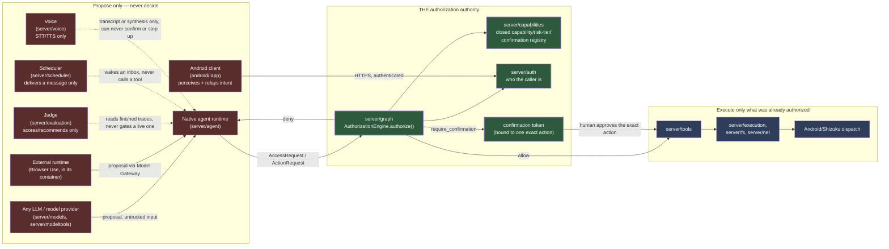
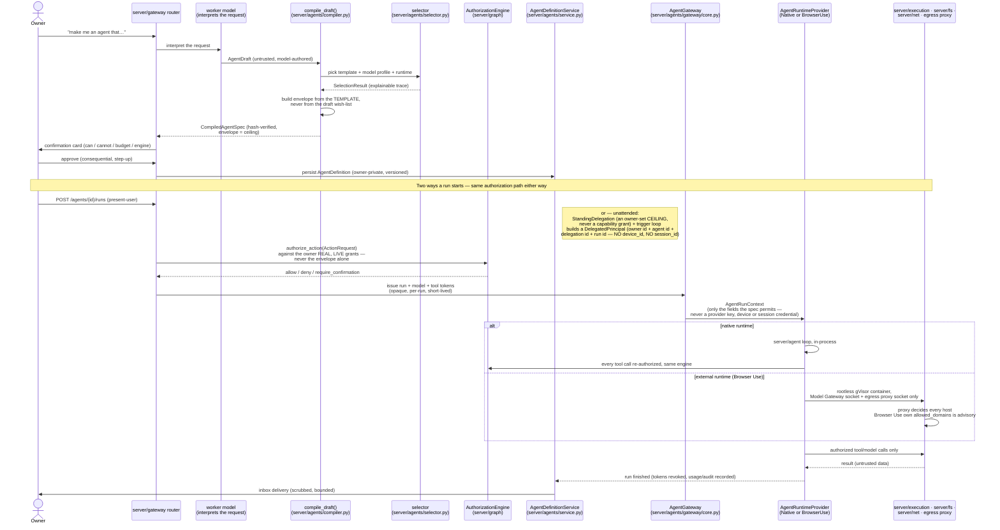

# JARVIS architecture — consolidated reference (Phases 1–6)

Produced by the Architecture Consolidation + Integration Hardening milestone
after Phase 6 merged. This document does not change the architecture; it
makes the one that already exists in the code and in `Working Markdown/*`
and `docs/*` legible from a single place. Where this document and a
subsystem doc (`Working Markdown/0X_*.md`, `docs/1X_*.md`+) disagree, the
subsystem doc and the code win — file an issue against this document, not
the other way around.

Companion reading: `README.md` (what's built, per branch, and what is not),
`CLAUDE.md` (module layering + import-linter contracts), `Working Markdown/TRACK_B_ARCHITECTURE_INDEX.md`
(the 17-document map), `docs/29_AGENT_FACTORY_ASSESSMENT.md` (the Agent
Factory's own detailed contract), `docs/HOW_JARVIS_WORKS.md` (the narrative
walkthrough a new engineer should read first).

---

## 0. The one invariant everything below exists to enforce

```
AGENT PROPOSES → DETERMINISTIC INFRASTRUCTURE AUTHORIZES → TOOLS EXECUTE → HUMAN CONFIRMS WHERE REQUIRED
```

Model output is a proposal, not an authority. This holds whether the
proposer is the native in-process runtime or an external contained runtime
(Browser Use), and whether the request started as a present-user HTTP call
or a trigger-fired unattended run. **Nothing in this codebase lets a model,
an agent runtime, a judge, a scheduler, a memory store, or a device grant
itself authority** — see §2.

---

## 1. Canonical high-level system diagram

```mermaid
flowchart TB
    subgraph CLIENT["Clients"]
        ANDROID_APP["Android app\n(android/:app)"]
        API_CALLER["Any API caller\n(HTTP)"]
    end

    subgraph GATEWAY["server/gateway — the one HTTP entry"]
        ROUTERS["FastAPI routers\n(request context, versioning,\nerror envelope, request_id)"]
        SUPERUSER_ENTRY["superuser auth\n(control_port)"]
    end

    subgraph SECCORE["server/auth + server/graph + server/capabilities + server/secrets\n— THE AUTHORIZATION AUTHORITY"]
        AUTH["server/auth\nOIDC · device credentials ·\nopaque tokens · step-up"]
        ENGINE["AuthorizationEngine\n(server/graph/authorization.py)\nmembership · role · ownership ·\nvisibility · capability"]
        CAPS["CAPABILITY_REGISTRY\n(server/capabilities/registry.py)\nclosed registry, risk tiers,\nconfirmation requirements"]
        SECRETS["SecretStore\n(server/secrets)\nAES-256-GCM, external KEK,\nhandle-only access"]
    end

    subgraph RUNTIME["server/agent — the native runtime loop (05/18)"]
        LOOP["propose → parse → authorize →\nconfirm → execute → observe"]
        BREAKER["breaker / supervisor\n(server/composition/supervisor.py)"]
    end

    subgraph FACTORY["server/agents — the Agent Factory (docs/29)"]
        DRAFT_PIPE["AgentDraft → compiler → selector →\nCompiledAgentSpec"]
        AGW["AgentGateway\n(run tokens, nonces, replay,\nmodel alias + budget)"]
        PROVIDERS["AgentRuntimeProvider impls:\nNativeRuntimeProvider ·\nBrowserUseRuntimeProvider"]
        DELEG["StandingDelegation\n+ DelegatedPrincipal\n+ trigger loop"]
    end

    subgraph EXEC["server/execution + server/fs + server/net"]
        FSBOX["fs sandbox\ndir_fd + O_NOFOLLOW"]
        EGRESS["default-deny egress\nDNS-rebinding safe"]
        PROC["argv-only process exec"]
        ANDROID_DISPATCH["Android/Shizuku dispatch"]
    end

    subgraph EXTRT["Untrusted execution infrastructure (Phase 6)"]
        CONTAINER["rootless Podman + gVisor\ncontainer, no network iface"]
        MODELGW_SOCK["per-run Model Gateway\nUnix socket"]
        EGRESSPROXY["per-run JARVIS CONNECT\nproxy, Unix socket"]
        BROWSERUSE["Browser Use\n(its own safety/domain\ncontrols: ADVISORY ONLY)"]
    end

    subgraph DATA["Supporting stores — never authorities"]
        MEMORY["server/memory\nMem0Provider (owner/graph-filtered)"]
        VAULT["server/vault\nKnowledge Vault (Git-backed)"]
        NOTEBOOK["AgentNotebookEntryRow\n(owner-private, per agent)"]
        SCHED["server/scheduler\nDatabaseSchedulerBackend"]
        JUDGE["server/evaluation\nMeteredJudgeModel / Judge"]
        USAGE["UsageEvent ledger"]
        AUDIT["AuditEvent log"]
    end

    subgraph STORAGE["server/storage + server/config"]
        DB[("SQLite (dev) /\nPostgreSQL (pilot, H-1)")]
    end

    ANDROID_APP -->|HTTPS + device cred| ROUTERS
    API_CALLER --> ROUTERS
    ROUTERS --> AUTH
    AUTH --> ENGINE
    ROUTERS --> LOOP
    ROUTERS --> DRAFT_PIPE
    LOOP -->|AccessRequest| ENGINE
    DRAFT_PIPE -->|AccessRequest / ActionRequest| ENGINE
    ENGINE --> CAPS
    LOOP -->|handle only| SECRETS
    PROVIDERS -->|handle only| SECRETS
    ENGINE -.decision only, no side effect.-> LOOP
    ENGINE -.decision only, no side effect.-> PROVIDERS
    LOOP --> FSBOX & EGRESS & PROC & ANDROID_DISPATCH
    AGW --> PROVIDERS
    DRAFT_PIPE --> AGW
    DELEG -->|server-driven run, same AGW path| AGW
    PROVIDERS -->|NativeRuntimeProvider| LOOP
    PROVIDERS -->|BrowserUseRuntimeProvider| CONTAINER
    CONTAINER --- MODELGW_SOCK
    CONTAINER --- EGRESSPROXY
    MODELGW_SOCK -->|model token only| AGW
    EGRESSPROXY -->|allow/deny by JARVIS policy| BROWSERUSE
    CONTAINER --> BROWSERUSE
    EGRESSPROXY -->|only permitted hosts| INTERNET(["explicit allowed\nweb host"])
    LOOP -. visibility-filtered reads .-> MEMORY
    LOOP -. visibility-filtered reads .-> VAULT
    PROVIDERS -. owner-scoped .-> NOTEBOOK
    SCHED -->|delivers a message, never executes| ROUTERS
    JUDGE -. observes traces only .-> LOOP
    LOOP --> USAGE & AUDIT
    PROVIDERS --> USAGE & AUDIT
    ENGINE --> AUDIT
    ANDROID_DISPATCH -->|authorized op only| ANDROID_APP
    ENGINE <--> DB
    AGW <--> DB
    DELEG <--> DB
    USAGE <--> DB
    AUDIT <--> DB

    classDef authority fill:#2d5a3d,color:#fff,stroke:#1a3a26,stroke-width:2px
    classDef notauthority fill:#5a2d2d,color:#fff,stroke:#3a1a1a,stroke-width:1px
    classDef untrusted fill:#5a4a1a,color:#fff,stroke:#3a2f10,stroke-width:2px,stroke-dasharray: 4 3
    class ENGINE,CAPS,AUTH authority
    class LOOP,PROVIDERS,JUDGE,SCHED,MEMORY,ANDROID_APP,BROWSERUSE notauthority
    class CONTAINER,MODELGW_SOCK,EGRESSPROXY,BROWSERUSE untrusted
```



Legend: **green** = the authorization authority (the only boxes that decide
`allow` / `deny` / `require_confirmation`). **red** = things that *propose*,
*observe*, *execute on request*, or *deliver* — never decide. **amber
dashed** = untrusted execution infrastructure (Phase 6): everything inside
that boundary is assumed hostile and is contained by what's outside it, not
trusted to contain itself.

---

## 2. Deterministic authorization / trust-boundary diagram

This is the diagram Part A of this milestone exists to make unmissable: who
*can* say "allow", and who only ever asks, executes, observes, or relays.



**Explicit non-authorities** (none of these can allow, deny, confirm, grant,
escalate, or execute on their own say):

| Component | What it actually does | Why it is not an authority |
|---|---|---|
| Any LLM / model provider | emits the next proposed step | parsed deterministically, authorized like any untrusted input (`05`) |
| Native agent runtime (`server/agent`) | orchestrates propose→authorize→execute→observe | it *calls* `AuthorizationEngine.authorize()`; it cannot import `server.secrets`, `server.capabilities`, or `server.graph` directly (import-linter contract) |
| External runtime / Browser Use | runs untrusted code in a container | contained by `server/execution/containers.py` + `server/net/egress_proxy.py`, which it cannot reach around; its own `allowed_domains`/judge/approval mechanisms are read by nothing on the JARVIS side |
| Judge (`server/evaluation`) | scores and recommends | `server.evaluation` never authorizes, executes, or resolves secrets, and the runtime never depends on it (CLAUDE.md layering) |
| Scheduler (`server/scheduler`) | fires a reminder that delivers a message | a firing reminder "delivers a message, never executes" (CLAUDE.md); the tap that follows is the owner's own authenticated run, re-checked from scratch |
| Memory (`server/memory`, Mem0) | hydrates context | visibility is re-checked with the engine's own predicate at hydration, never trusted from the store |
| Android client | perceives the device, carries user intent | "a phone is an execution target bound to a principal, not a source of authority" (README) |
| Voice (`server/voice`) | STT/TTS | "voice can never confirm or step up" (CLAUDE.md) |

---

## 3. Agent Factory lifecycle diagram



**What this corrects relative to treating the Agent Factory as "one more
tool call":** an `AgentDefinition` (the owner's durable, versioned record)
and a `CompiledAgentSpec`/envelope (the deterministic, hash-verified
ceiling the compiler derived from it) and an `AgentRun` (one execution
instance, with its own tokens, deadline and budget) are three different
objects with three different lifetimes — see the distinctions table in §5.
A `StandingDelegation` never appears on the right of an `AccessRequest`; it
only ever narrows what a `DelegatedPrincipal`'s *real* grants (checked fresh,
every time) are allowed to do.

---

## 4. External-runtime diagram (Phase 6, Browser Use)

```mermaid
flowchart LR
    JARVIS["JARVIS server process\n(owns every decision)"]

    subgraph GW["Agent Gateway (server/agents/gateway)"]
        TOK["run + model tokens\n(opaque, per-run, revocable)"]
    end

    subgraph MG["Model Gateway\n(server/composition/model_gateway.py)"]
        MGSOCK["per-run Unix socket\n/run/jarvis/model.sock\nbound to THIS run_id only"]
    end

    subgraph CONTAINER_BOX["rootless Podman + gVisor runsc\n(server/execution/containers.py)\n— NO network interface —"]
        BU["Browser Use\n(runtime/browser_use/entrypoint.py)"]
        CHROME["Chromium\n(use_vision off, no stored creds)"]
    end

    subgraph EP["Egress proxy\n(server/net/egress_proxy.py)"]
        EPSOCK["per-run Unix socket\n/run/jarvis/egress.sock\nCONNECT host:port only"]
        POLICY["exact hosts ∩ operator's\nEgressPolicy — default deny"]
    end

    HOST(["explicitly permitted\nweb host"])
    OTHER_HOST(["any other host\n(refused — AGENT-T12)"])

    JARVIS --> TOK
    TOK --> MGSOCK
    JARVIS --> EPSOCK
    MGSOCK -.the ONLY route to a model, model token only, no provider key.-> BU
    BU --> CHROME
    CHROME -->|all traffic, incl. Browser Use own CDP websocket| EPSOCK
    EPSOCK --> POLICY
    POLICY -->|allowed| HOST
    POLICY -->|refused, whatever allowed_domains said| OTHER_HOST
    BU -.advisory only, never consulted by JARVIS's own decision.-> ADVISORY["Browser Use's own\nallowed_domains / judge /\napproval mechanisms"]

    classDef untrusted fill:#5a4a1a,color:#fff,stroke-dasharray: 4 3
    classDef authority fill:#2d5a3d,color:#fff
    classDef advisory fill:#444,color:#bbb,stroke-dasharray: 2 2
    class CONTAINER_BOX,BU,CHROME untrusted
    class JARVIS,GW,MG,EP,POLICY authority
    class ADVISORY advisory
```



Key facts this diagram makes explicit (OD-AF-11…15, register §2L):

- The container has **no general-purpose network interface at all**
  (`--network=none`, gVisor `network=none`) — its only two reachable
  endpoints are the two Unix sockets mounted into it, and `host-uds=open`
  means a host socket is reachable only because JARVIS chose to mount it.
- The Model Gateway socket is **bound to one `run_id`**; another run's
  valid token is refused on it (OD-AF-12).
- The egress proxy is **the authority** for which host is reachable; it
  resolves DNS itself and connects to the address it checked (no DNS
  rebinding). Browser Use's `allowed_domains` is a convenience copy of the
  same host list, read by nobody on the JARVIS side — advisory, not
  authority (OD-AF-13).
- No TLS interception: the proxy decides *which hosts*, not *what is sent to
  them* — which is exactly why `browser.session`/`browse` is `low_write`,
  never `low_read` (the documented, ratified trade-off).
- Isolation (rootless Podman + gVisor, digest-pinned image, no
  capabilities, read-only root) is enforced by `server/execution/containers.py`
  and verified at startup — never something Browser Use or the container
  image is trusted to enforce on itself.

---

## 5. Repository / module map

Layering (bottom → top; mechanically enforced by `import-linter`,
`pyproject.toml`'s `[tool.importlinter]`, 32 contracts as of Phase 6):

```
config | storage
secrets
security
net | fs
execution
graph | capabilities
auth
gateway
models
agent | agents | modeltools | tools | memory | vault | scheduler | voice | evaluation
dashboard
composition
```

| Architectural component | Package / file | Key class or function |
|---|---|---|
| Authentication | `server/auth` | OIDC flow, Ed25519 device credentials, opaque tokens |
| **Authorization authority** | `server/graph/authorization.py` | `AuthorizationEngine`, `AccessRequest`, `AuthorizationOutcome` |
| Capability/risk-tier registry | `server/capabilities/registry.py` | `CAPABILITY_REGISTRY`, `CapabilityDefinition` |
| Secrets | `server/secrets` | `SecretStore` (handle-only) |
| Native agent runtime loop | `server/agent` | the propose→authorize→confirm→execute→observe loop (`05`/`18`) |
| Model providers / LLM-as-tool | `server/models`, `server/modeltools` | normalized `ModelProvider` interface |
| Tool registry + adapters | `server/tools` | per-platform adapters, validated against `CAPABILITY_REGISTRY` |
| Constrained execution | `server/execution`, `server/fs`, `server/net` | `ExecutionRequest`, fs sandbox, egress client, process exec |
| `AgentDraft` | `shared/schemas/agent_factory.py` | `AgentDraft` — untrusted, model-authored intent |
| `AgentTemplate` registry | `server/agents/registry/templates.py` | `AgentTemplate` (repo-versioned YAML) |
| `AgentModelProfile` registry | `server/agents/registry/models.py` | `AgentModelProfile` |
| `AgentRuntimeProfile` registry | `server/agents/registry/runtimes.py` | `AgentRuntimeProfile`, `NATIVE_RUNTIME`, `BROWSER_USE_RUNTIME`, `BROWSER_USE_IMAGE` |
| The compiler | `server/agents/compiler.py` | `compile_draft()` — the only writer of `CompiledAgentSpec` |
| The selector | `server/agents/selector.py` | template/model/runtime selection, explainable trace |
| `CompiledAgentSpec` / envelope | `shared/schemas/agent_factory.py` | `CompiledAgentSpec`, `EnvelopeEntry` — **a ceiling, never a grant** |
| `AgentDefinition` (durable, owner-private) | `server/storage/models.py`, `server/agents/service.py` | `AgentDefinitionRow`, `AgentDefinitionService` |
| `AgentRun` | `server/storage/models.py` | `AgentRunRow`, `AgentRunTokenRow` |
| Agent Gateway (run tokens, replay, budget) | `server/agents/gateway/core.py` | `AgentGateway` |
| Model Gateway (HTTP face for external runtimes) | `server/composition/model_gateway.py`, `server/gateway/routers/model_gateway.py` | `HttpModelGateway`, `ModelGatewayListener`, `build_model_gateway_app` |
| `AgentRuntimeProvider` implementations | `server/agents/providers/` | `NativeRuntimeProvider`, `BrowserUseRuntimeProvider` |
| `StandingDelegation` | `server/agents/delegation.py`, `server/storage/models.py` | `StandingDelegationRow`, `StandingDelegationView` — **a ceiling, not a grant** |
| `DelegatedPrincipal` | `shared/schemas/authorization.py` | `DelegatedPrincipal` — **no `device_id`, no `session_id`** |
| Trigger loop (unattended runs) | `server/agents/triggers.py`, `server/composition/agent_triggers.py` | the misfire/coalescing/day-limit logic |
| External runtime containment | `server/execution/containers.py`, `server/composition/containers.py` | `ContainerSpec`, `ContainerEngine`, `ContainerReconciler` |
| External runtime egress | `server/net/egress_proxy.py` | `EgressProxy`, `ProxyPolicy`, `policy_for_run` |
| Browser Use capability/policy | `server/agents/browser.py` | `BROWSER_CAPABILITY`, `browse_hosts`, `read_result` |
| Browser run orchestration | `server/composition/browser_runs.py` | `BrowserRuns` (the kill path, supervision, finish, recovery) |
| Memory (Mem0) | `server/memory` | `MemoryProvider`, `Mem0MemoryProvider` — visibility re-checked at hydration |
| Agent notebook | `server/storage/models.py` | `AgentNotebookEntryRow` — owner-private, per agent, separate from Mem0 |
| Knowledge Vault | `server/vault` | `VaultIndex` — Git-backed, separate store from Mem0 and the notebook |
| Scheduler | `server/scheduler` | `SchedulerBackend`, `DatabaseSchedulerBackend` — fires a reminder, never a tool |
| Judge | `server/evaluation` | `MeteredJudgeModel` and friends — observes, scores, never authorizes |
| Usage ledger | `server/storage/models.py` | `UsageEvent` |
| Audit log | `server/security/audit.py`, `server/storage/models.py` | `AuditLogger`, `AuditEvent` |
| Android server-side dispatch | `server/execution` (Android/Shizuku half) | capability→operation→primitive mapping |
| Android client | `android/:app`, `android/:contract` | shares only `shared/schemas/` with the server |
| Voice | `server/voice` | STT/TTS; "voice can never confirm or step up" |
| Dashboard (read-only) | `server/dashboard` | consults read-only Protocols only |
| Composition root | `server/composition` | the only place upper-layer Protocols get concrete implementations |
| HTTP entry | `server/gateway` | FastAPI routers, request context, superuser entry |

---

## 6. Explicit distinctions (so the names in code never blur in conversation)

| Term | What it is | What it is *not* |
|---|---|---|
| `Principal` | the live, server-side identity behind a present-user request: user + device + session | not a grant — it's *who*, checked fresh every request |
| `DelegatedPrincipal` | the identity behind an unattended trigger-fired run: owner + agent + delegation + run | **has no `device_id`, no `session_id`** — device/app operations are refused before the engine even sees it |
| `Graph` | the membership/visibility scope a resource lives in | decided fresh at every access; never cached into a token |
| `Grants` (`CapabilityGrant`) | the owner's actual, live, revocable permissions | the only thing `AuthorizationEngine.authorize()` checks against — never the envelope, never the draft |
| `AgentDefinition` | the durable, owner-private, versioned record of an agent | identity + history; survives across many runs |
| `AgentTemplate` | a repo-versioned, operator-enabled YAML shape (abilities, risk ceiling, run mode) | one template serves many `AgentDefinition`s |
| `AgentModelProfile` | an operator-configured model entry an agent may use | config, not code |
| `AgentRuntimeProfile` | a code-registered runtime (native or external) with its isolation/network/infra requirements | decides *where* a run executes, never *whether* it may |
| `AgentDraft` | the model-authored, **untrusted** statement of intent that starts compilation | never executed, never trusted, never the source of the envelope's scope |
| `AgentCompiler` (`compile_draft`) | the deterministic function that turns a draft + template into a `CompiledAgentSpec` | the *only* writer of a spec; the draft's wishes are filtered through the template, not copied |
| `AgentSelector` | the deterministic, explainable chooser of template/model/runtime | produces a trace, not a decision with authority |
| `CompiledAgentSpec` / envelope | the hash-verified ceiling a run may never exceed | **a ceiling, never a source of authority** — it narrows what the owner's real grants already allow, it does not grant anything by itself |
| `AgentGateway` | issues/validates run and model tokens, enforces replay/nonce/budget | the one place an external or native runtime presents a token instead of a session |
| `AgentRuntimeProvider` | the code that actually drives a run (native in-process, or an external container) | untrusted execution infrastructure for `BrowserUseRuntimeProvider`; in-process but still non-authoritative for `NativeRuntimeProvider` |
| `Task` | one unit of authorized work inside the native runtime loop | the native runtime's unit; an `AgentRun` may or may not have one |
| `AgentRun` | one execution instance of an `AgentDefinition`: its own tokens, deadline, budget | ends exactly once, however it ends (§ stop/recovery) |
| `StandingDelegation` | an owner-set **ceiling** permitting unattended runs within limits (budget, days, risk tier) | **never a capability grant** — an unattended run still uses only the owner's own standing grants, re-checked fresh |
| Memory (Mem0) | cross-session recall, owner/graph-visibility-filtered | not the agent notebook, not the Vault |
| Agent notebook | an agent's own scratch notes, owner-private, per agent | not Mem0, not shared across agents |
| Knowledge Vault | Git-backed documents, indexed and queried separately | not Mem0, not the notebook |
| Usage | the metering ledger every model/tool call writes to | attribution target for budgets; not authorization |
| Audit | the append-only log of security-relevant events | evidence, not enforcement |
| Judge | scores/recommends from finished traces | never authorizes, executes, or resolves secrets |
| Scheduler | fires reminders on time | "delivers a message, never executes" |
| Android endpoint | perceives the device, carries intent, executes authorized device ops | never a trust root |
| External runtime | untrusted code in a rootless gVisor container | contained by deterministic infrastructure it cannot see around |

---

## 7. The existing diagram this milestone replaces, and why

The closest thing to a system diagram in the repository before this
milestone was the component tree in `docs/29_AGENT_FACTORY_ASSESSMENT.md`
§3 ("3. Architecture") and the single-loop flowchart in
`Working Markdown/05_AGENT_RUNTIME.md` §1. Both are still accurate as far
as they go and are not being deleted — this document supplements, not
replaces, their content.

**docs/29 §3 (the Agent Factory component tree) — what it gets right:**
- Correctly separates the compiler, the selector, the two registries
  (template/model), and the runtime-profile registry as distinct boxes.
- Correctly shows the Agent Gateway's two halves (Model Gateway, Tool
  Gateway) as siblings under one gate.
- Its package-layout table (§3.1) is accurate and this document's §5 builds
  directly on it rather than inventing a competing one.

**What it omits:**
- No request lifecycle at all — it is a parts list, not a flow. A reader
  cannot tell from it how an `AgentDraft` becomes a running agent, where
  the owner confirms, or where `StandingDelegation` sits relative to a
  present-user run.
- No trust-boundary information — nothing in the diagram distinguishes "can
  decide" from "can only propose, execute, or observe." A new engineer
  reading it would have no way to tell that the Judge or the Scheduler
  boxes are not authorities.
- No external-runtime containment detail — "External Runtime Providers" is
  one box with four bullet children; it says nothing about the container,
  the two sockets, or the egress proxy.
- Written before Phase 5/6 existed, so it necessarily omits
  `DelegatedPrincipal`, the trigger loop, the Model Gateway, and the whole
  container/egress-proxy boundary.

**What it visually implies incorrectly, now that Phases 5–6 are built:**
- `"External Runtime Providers [FUTURE / infrastructure-blocked]"` groups
  Browser Use (built, Phase 6) under the same "blocked" heading as
  OpenHands/Letta/OpenClaw (still not built) — a reader skimming it today
  would wrongly conclude Browser Use is still hypothetical.
- `"Scheduler / Delegation (22 reminders now; StandingDelegation after the
  PRD amendment)"` reads as a future-conditional; `StandingDelegation` has
  been built and shipped (Phase 5) since that line was written.
- The flat tree gives every box equal visual weight, which reads as "these
  are peers" — it does not communicate that `AuthorizationEngine` sits
  structurally below and outside everything that proposes or executes.

**What the new diagrams in this document correct:**
- §1 adds the missing system-wide flow and explicitly marks the
  authorization authority vs. everything that only proposes/executes/
  observes/delivers (color-coded, not left to the reader to infer).
- §2 is the trust-boundary diagram by itself, so "who can say allow" is
  never buried inside a bigger picture.
- §3 is the lifecycle sequence diagram Part A asked for, covering both the
  present-user and `StandingDelegation` start paths through one gate.
- §4 gives the external-runtime box the detail docs/29's tree never had:
  the container, both sockets, the proxy's authority over hosts, and
  Browser Use's own controls marked advisory.
- §5/§6 turn the package table and the Agent-Factory-specific class list
  into a whole-system map, current through Phase 6.

`Working Markdown/05_AGENT_RUNTIME.md` §1's loop diagram — what it gets
right: the deny-is-an-observation-never-retried-or-escalated rule, and the
four-way proposal split (final / tool / model-tool / memory-or-action).
What it omits, necessarily (it predates the Agent Factory entirely): any
notion of `AgentDraft`/compiler/selector/envelope, `StandingDelegation`,
external runtimes, or the Agent Gateway. It remains the correct diagram for
*one iteration of the native loop specifically* — §3 of this document is
the diagram for everything around it.
